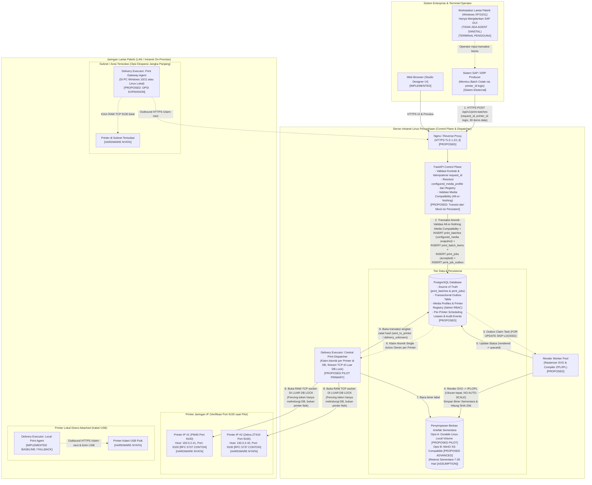
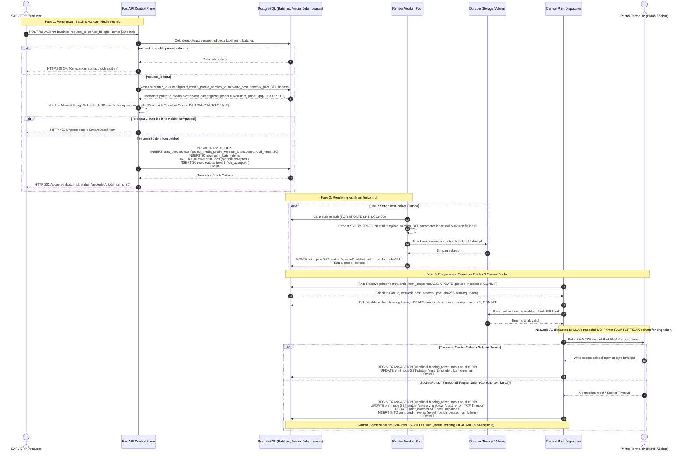
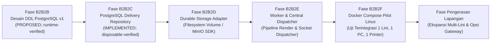

# Proposal Arsitektur Production: Opsi Sistem, Komponen, dan Roadmap Bertahap

> **Status B2B2C:** DDL tetap merupakan baseline **PROPOSED**, sedangkan adapter
> lifecycle delivery PostgreSQL, migration runner eksplisit, fencing token HTTP,
> dan durable artifact root telah **IMPLEMENTED** serta diuji pada PostgreSQL
> 15 disposable. Harness saat ini mencakup 34 negative test cases. Status ini
> bukan production-deployed atau production-ready; load test, role isolation,
> backup/restore, upgrade migration produksi, dan printer fisik belum diuji.
> ADR-010 sampai ADR-023 tetap kandidat PROPOSED; ADR-024 dan ADR-025 telah
> dicatat sebagai keputusan implementasi B2B2C di `DECISIONS.md`.

> - **Status Dokumen**: `PROPOSED` (Proposal Arsitektur Fase 2.3B2B2B — *PostgreSQL Persistence Schema & DDL Design*)
> - **Tanggal Pembaruan**: 2026-09-18
> - **Target Sistem**: Thermal Label Studio (Control Plane Web Service, Delivery Executor / Central Print Dispatcher, & Local Print Agent)
> - **Target Lingkungan**: Server Intranet Linux Perusahaan, Plant dengan 200–300 Printer (Intermec, Zebra, Honeywell)
> - **Dokumen Terkait**: [`docs/database/print_pipeline_persistence.md`](file:///c:/Users/fiqih/Documents/0000_TRST/Cline/0009_JSON_SVG_LABEL/web_app/docs/database/print_pipeline_persistence.md), [`docs/database/print_pipeline_v1.sql`](file:///c:/Users/fiqih/Documents/0000_TRST/Cline/0009_JSON_SVG_LABEL/web_app/docs/database/print_pipeline_v1.sql), [`docs/architecture/print_job_and_local_agent.md`](file:///c:/Users/fiqih/Documents/0000_TRST/Cline/0009_JSON_SVG_LABEL/web_app/docs/architecture/print_job_and_local_agent.md), [`docs/contracts/print_job_v1.schema.json`](file:///c:/Users/fiqih/Documents/0000_TRST/Cline/0009_JSON_SVG_LABEL/web_app/docs/contracts/print_job_v1.schema.json), [`docs/DECISIONS.md`](file:///c:/Users/fiqih/Documents/0000_TRST/Cline/0009_JSON_SVG_LABEL/web_app/docs/DECISIONS.md)

---

## 0. Taksonomi Status Dokumen

Untuk menjaga transparansi teknis dan membedakan fakta yang sudah teruji dengan rencana masa depan, dokumen ini menggunakan label status standar berikut:

- `[IMPLEMENTED]`: Kode, kontrak, atau fungsi yang telah selesai diimplementasikan dan diverifikasi oleh rangkaian tes otomatis di repository saat ini.
- `[PROPOSED]`: Opsi desain arsitektur, pola sistem, atau teknologi kandidat yang diusulkan untuk fase implementasi mendatang.
- `[ASSUMPTION]`: Asumsi operasional, estimasi throughput, atau parameter bisnis yang menunggu konfirmasi resmi dari pemangku kepentingan.
- `[OPEN QUESTION]`: Pertanyaan kritis terbuka yang memerlukan keputusan bisnis, konfirmasi tim infrastruktur IT, atau investigasi lapangan.
- `[NOT IMPLEMENTED]`: Kemampuan target yang saat ini **belum ada** di repository (misalnya koneksi socket printer fisik nyata, Windows Service, broker nyata, atau database nyata).

---

## 1. Fakta Terverifikasi Lingkungan Perusahaan (*Verified User Facts*)

Berdasarkan konfirmasi pengguna dan analisis operasional perusahaan terkini:

1. **Target Hosting Control Plane**: Web service dan database akan di-host pada **server intranet perusahaan berbasis Linux** (bukan di public cloud terbuka).
2. **Keterjangkauan Jaringan (*Network Reachability*)**:
   - Pengujian RAW TCP Port 9100 dari komputer workstation pengguna ke printer LAN intranet pernah berhasil di lapangan dan label mulai tercetak dalam waktu kurang dari satu detik (`[VERIFIED OPERATIONAL FACT]`).
   - **Namun**, keterjangkauan jaringan aktual dari **server Linux intranet** ke Port 9100 printer di lantai pabrik **belum pernah diuji** dan masih harus diverifikasi secara empiris dalam pilot (`[OPEN QUESTION]`).
3. **Skala Endpoint Printer**:
   - Terdapat sekitar **200–300 titik printer termal** di area pabrik (*plant*).
   - **Proporsi aktual** antara printer jaringan IP (Ethernet/Wi-Fi) dibanding printer lokal (*direct-attached* USB/Serial) **belum diketahui secara pasti** (`[OPEN QUESTION]`). Sistem dilarang mengasumsikan bahwa sebagian besar printer pasti memakai jaringan IP.
4. **Merek Printer**: Mencakup printer industri **Intermec**, **Zebra**, dan **Honeywell** (termasuk model Intermec/Honeywell PM45 dan Zebra industri).
5. **Karakteristik Permintaan Cetak (*Print Batch vs Copies vs Media*)**:
   - Satu permintaan cetak dari SAP adalah sebuah **Print Batch** yang membawa sekitar 30 label yang benar-benar berbeda.
   - Setiap label mempunyai data sendiri.
   - Label-label tersebut mungkin memakai template yang sama atau template berbeda, tetapi harus kompatibel dengan ukuran dan media fisik yang sama pada printer target.
   - Setiap label harus dimodelkan sebagai **satu batch item** dan **satu print job/artifact tersendiri**.
   - Nilai bawaan (*default*) untuk setiap label item adalah `copies = 1`. Parameter `copies` secara ketat hanya berarti **duplikat fisik identik**, bukan jumlah item berbeda.
   - **Single-Printer & Single-Media per Batch**: Seluruh item dalam satu batch selalu ditujukan ke **satu printer fisik** dan menggunakan **satu konfigurasi media profile yang diharapkan (*expected/configured media profile*)**.
   - Setiap titik printer pada umumnya memiliki ukuran/media tetap berdasarkan plant, lini produksi (*production line*), atau produk yang dihasilkan.
   - Untuk pilot: satu printer dimodelkan memiliki satu **configured/expected media profile**.
   - SAP hanya mengirim `printer_id` logis. Media profile, DPI, bahasa printer, dan network endpoint harus di-resolve oleh server dari tabel inventaris printer (`printer_registry`).
   - Nilai `configured_media_profile_version_id` harus disimpan sebagai snapshot pada batch untuk kebutuhan audit.
   - **Pergantian Roll Fisik**: Sistem belum memiliki sensor yang dapat membuktikan roll yang benar-benar terpasang di printer fisik. Jika media fisik/roll diganti di lantai pabrik, konfigurasi di registry harus diperbarui atau dikonfirmasi oleh admin/operator. Sistem **dilarang mengklaim otomatis mengetahui roll fisik**.
   - **Validasi Kompatibilitas Atomik (*All-or-Nothing*)**: Seluruh item dalam batch harus divalidasi terhadap media profile sebelum antrean tugas dibuat. Jika ada satu item saja yang tidak kompatibel, seluruh batch **wajib ditolak secara atomik** dengan pesan error yang menunjuk item mana dan alasan ketidakcocokannya.
   - **Dilarang Auto-Scale Diam-diam**: Sistem dilarang melakukan perbesaran/pengecilan otomatis (*auto-scaling/stretching*) terhadap template yang berbeda ukuran dari media fisik, karena berisiko merusak rasio barcode, font, dan kepatuhan standar industri.
6. **Estimasi Beban Jendela Sibuk (*Estimated Busy-Window Throughput*)**:
   - Lebih dari 10 printer dapat melakukan pencetakan dalam waktu berdekatan (dalam jendela waktu sekitar 5 menit).
   - Estimasi throughput: $10 \text{ batch} \times \approx 30 \text{ item} \approx 300 \text{ job}$ dalam 5 menit ($\approx 300 \text{ detik}$), menghasilkan **estimated throughput sekitar $1 \text{ job per detik}$ pada jendela sibuk**, bukan peak concurrency sesaat.
   - Estimasi throughput $1 \text{ job/detik}$ ini menunjukkan bahwa arsitektur PostgreSQL murni sangat menjanjikan untuk tahap awal. **Namun, kecukupan PostgreSQL dan worker pool harus dibuktikan secara nyata melalui pengujian beban (*load test*)**.
7. **Peran dan Batasan Workstation Legacy Windows XP**:
   - Komputer workstation di lantai pabrik mencakup sistem lama (Windows XP) hingga modern (Windows 10/11).
   - Workstation Windows XP difungsikan sebagai **terminal SAP GUI murni** untuk memasukkan transaksi bisnis.
   - Dengan mengirim cetakan langsung dari server Linux intranet ke printer IP, **tidak ada dependensi runtime Python modern maupun stack TLS baru yang perlu diinstal di Windows XP**.
   - **Koreksi Batasan Keamanan**: Hal ini mengeliminasi kerepotan instalasi perangkat lunak baru di XP, **tetapi tidak berarti risiko Windows XP hilang 100%**. Workstation Windows XP tetap memiliki risiko keamanan bawaan sebagai *legacy endpoint* jaringan korporat.
8. **Target Kinerja Awal Pilot (*Pilot Performance Targets*)**:
   - Rollout dilakukan bertahap: **1 lini produksi, 1 printer jaringan, dan 1 alur SAP**.
   - Target latensi awal:
     - Penerimaan API batch (*API batch acceptance*): **$< 1 \text{ detik}$**.
     - Item pertama terkirim (*first item sent_to_printer* P95): **$< 5 \text{ detik}$**.
     - Pemrosesan per-item setelah menjadi kepala antrean (*head-of-line processing* P95): **$< 5 \text{ detik}$**.
     - Waktu penyelesaian batch keseluruhan (*total batch completion*): **bergantung pada kecepatan mekanis printer fisik** (kecepatan motor cetak dan feeding label).
   - **Distingsi Kritis**: Status `sent_to_printer` **TIDAK SAMA** dengan `printed` (label fisik keluar sempurna dan terbaca). Sistem dilarang mengklaim bahwa seluruh batch 30 item harus selesai dicetak dalam 5 detik.
9. **Konteks Tim dan Pengelola Aplikasi**:
   - Pengembangan hingga aplikasi siap digunakan (*pilot-ready*) dipimpin secara mandiri oleh **SATU ORANG** (ABAP programmer yang menguasai integrasi SAP dan desain template label).
   - Tim IT Infrastruktur perusahaan dan programmer rekan kerja siap memberikan dukungan saat tahap peluncuran (*rollout*) dan pemeliharaan operasional skala penuh.
10. **Target Keandalan & Retensi Data**:
    - Target formal RTO/RPO serta kebijakan retensi berkas biner artefak masih berstatus menunggu konfirmasi kebijakan manajemen (`[OPEN QUESTION]`).

---

## 2. Kondisi Saat Ini vs Target Usulan (*Current State vs Proposed Target*)

Tabel berikut menyajikan perbandingan gamblang antara apa yang **benar-benar ada di kode hari ini** versus apa yang **dibekukan dalam proposal B2B2A.4**:

| Komponen / Kapabilitas | Kondisi Saat Ini (Baseline B2B1.4) | Status Saat Ini | Target Usulan Produksi (B2B2A.4 Freeze) | Status Target |
| :--- | :--- | :--- | :--- | :--- |
| **API Control Plane** | FastAPI dengan router `/api/v1/print-agent` di memori proses tunggal. | `[IMPLEMENTED]` | Modular Monolith FastAPI berjalan di server Linux intranet. | `[PROPOSED]` |
| **Model Permintaan Cetak** | Single Print Job individual per HTTP request. | `[IMPLEMENTED]` | **Hierarki Batch**: `print_batches` (1) $\to$ `print_batch_items` (N) $\to$ `print_jobs` (N). | `[PROPOSED]` |
| **Pemisahan Konsep Media** | Dimensi hanya atribut dasar template SVG. | `[IMPLEMENTED]` | **Pemisahan 4 Pilar**: Media Profile murni fisik, Printer Profile, Template Version, dan Renderer. | `[PROPOSED]` |
| **Penyimpanan Status Job** | `InMemoryPrintJobRepository` (data hilang jika server restart). | `[IMPLEMENTED]` | Database PostgreSQL dengan transaksi ACID, tabel Batches, Items, Media, Jobs, Leases, Registry, dan Audit Events. | `[PROPOSED]` |
| **Penyimpanan Berkas Label** | `TemporaryArtifactStorage` (folder sementara lokal). | `[IMPLEMENTED]` | **Opsi A**: Durable Linux Filesystem Volume (`[PILOT]`).<br/>**Opsi B**: MinIO S3-Compatible Storage (`[ADVANCED]`). (Retensi sementara 7–30 hari `[ASSUMPTION]`). | `[PROPOSED]` |
| **Mesin Render Label** | Dipanggil langsung dalam siklus eksekusi runner di satu proses. | `[IMPLEMENTED]` | Render Worker Pool terpisah (proses latar belakang dengan snapshot dependensi render lengkap). | `[PROPOSED]` |
| **Penyalur Antrean Tugas** | Pemanggilan method Python langsung di dalam memori. | `[IMPLEMENTED]` | Antrean tabel PostgreSQL (`FOR UPDATE SKIP LOCKED`). | `[PROPOSED]` |
| **Penjadwalan per Printer** | Tidak ada penjadwalan; eksekusi sekuensial tunggal. | `[IMPLEMENTED]` | **Per-Printer Scheduling**: 1 active delivery owner per printer, paralel antar-printer, anti-interleaving, lease atomik dengan fencing token di DB. | `[PROPOSED]` |
| **Topologi Pengiriman Cetak** | Deterministic `run_once()` offline Local Print Agent mock. | `[IMPLEMENTED]` | **Jalur Utama Pilot**: **Central Print Dispatcher** (Linux server langsung ke printer IP via Port 9100).<br/>**Jalur Subnet Terisolasi**: **Print Gateway Agent** per VLAN.<br/>**Jalur Fallback**: Local Agent untuk printer lokal USB. | `[PROPOSED]` |
| **Abstraksi Delivery Executor** | Terikat pada konsep `agent_id` di runner lokal. | `[IMPLEMENTED]` | Abstraksi netral: `executor_type` (`central_dispatcher`, `gateway_agent`, `local_agent`) dan `executor_id`. | `[PROPOSED]` |
| **Keamanan Endpoint Printer** | Kolom string `network_endpoint`. | `[IMPLEMENTED]` | Kolom terpisah: `network_host` dan `network_port` (integer) tervalidasi allowlist, Admin-Only RBAC, zero SAP payload input. | `[PROPOSED]` |
| **Transport Printer Fisik** | Mock in-memory transport (`MemoryPrinterTransport`). | `[IMPLEMENTED]` | Modul transport RAW TCP socket Port 9100 dengan connect/write timeout terkontrol mutlak di luar DB row lock. | `[NOT IMPLEMENTED]` |

---

## A. Ringkasan Eksekutif (Executive Summary untuk Pembaca Awam)

### Realitas Baru Lantai Pabrik: Dari Kesalahpahaman Menuju Kesederhanaan
Pada evaluasi awal, diasumsikan bahwa setiap printer di pabrik harus memiliki program agen pencetak (*agent software*) yang terpasang di komputer workstation operator di sampingnya. Asumsi ini menimbulkan kekhawatiran besar karena banyak komputer operator masih menggunakan sistem operasi lama **Windows XP**, yang tidak aman dan tidak dapat menjalankan library modern (Python modern dan TLS 1.2/1.3).

Namun, fakta lapangan memberikan gambaran yang lebih terarah:
1. **Server Linux Mengirim Langsung ke Printer IP**: Untuk printer industri yang terhubung ke jaringan LAN, server Linux intranet dapat membuka koneksi cetak langsung ke printer via Port 9100, tanpa melewati PC operator.
2. **Workstation Windows XP Bebas Instalasi Perangkat Lunak Baru**: Komputer Windows XP di pabrik difungsikan sebagai terminal layar untuk membuka aplikasi SAP GUI. Operator memasukkan data transaksi di SAP, SAP mengirim perintah ke server Linux, dan server Linux yang mengirimkan instruksi cetak ke printer. Hal ini mengeliminasi masalah runtime baru di XP, walaupun risiko keamanan bawaan dari OS lama pada jaringan tetap perlu dimitigasi oleh tim IT infrastruktur.
3. **Koneksi Port 9100 Server Linux Masih Harus Diverifikasi**: Meskipun pengujian socket dari PC pengguna ke printer jaringan pernah berhasil dalam waktu $< 1$ detik, koneksi aktual dari server Linux intranet ke subnet printer pabrik belum pernah diuji secara formal dan harus diverifikasi pada awal pilot (`[OPEN QUESTION]`).

### Memahami Perbedaan: Media Profile, Printer Profile, Template Version, dan Renderer
Untuk menjaga ketertiban teknis saat membuat skema database permanen, sistem memisahkan 4 pilar independen berikut:
- **Media Profile (Karakteristik Fisik Kertas/Stiker)**: Murni dimensi dan sifat mekanis kertas label (lebar mm, tinggi mm, `material_type` seperti paper/synthetic, `sensor_mode` seperti gap/black mark, dan orientasi fisik). Sifat ini **tidak boleh dicampur** dengan resolusi DPI atau bahasa pemrograman printer.
- **Printer Profile (Kemampuan Perangkat Keras)**: Kemampuan fisik mesin printer (merek Zebra/Intermec, model PM45/ZT410, resolusi titik DPI yang terkonfirmasi fisik, firmware, dan bahasa native ZPL/IPL).
- **Template Version (Desain Tata Letak Digital)**: Desain kanvas digital SVG yang memiliki versi dan content hash abadi, token `{{field}}`, barcode, QR, dimensi acuan, serta dependensi font/logo.
- **Renderer (Mesin Kompilasi Biner)**: Software dan parameter rasterisasi/kompilasi yang mengubah Template Version + Data SAP + Printer Profile menjadi **Artifact** biner (IPL/ZPL).

---

## B. Diagram Kontainer dan Komponen Arsitektur

> **Catatan Validasi Sintaks**: *Diagram di bawah telah diverifikasi melalui manual syntax review (bukan parser-verified otomatis) untuk memastikan kepatuhan standar visualisasi Mermaid.*

Diagram berikut membedakan komponen yang sudah ada (`[IMPLEMENTED]`) dengan komponen usulan (`[PROPOSED]`):



---

## C. Urutan Alur Lengkap (*End-to-End Sequence Diagram*)

> **Catatan Validasi Sintaks**: *Diagram di bawah telah diverifikasi melalui manual syntax review (bukan parser-verified otomatis). Diagram ini memodelkan alur ingestion batch, validasi kompatibilitas media all-or-nothing, per-printer scheduling, pemisahan network I/O dari DB row lock, dan batas proteksi fencing token.*



---

## D. Evaluasi Topologi Pengiriman Cetak dan Abstraksi Delivery Executor

Berdasarkan analisis operasional, sistem mengevaluasi tiga topologi pengiriman dengan menempatkan workstation Windows XP pada posisi yang tepat:

### 1. Perbandingan Karakteristik Tiga Topologi

| Dimensi Arsitektur | Topologi A: Central Print Dispatcher (Linux Server) | Topologi B: Print Gateway Agent (Per Area / VLAN) | Topologi C: Hybrid Topology (Target Jangka Panjang) |
| :--- | :--- | :--- | :--- |
| **Deskripsi Arsitektur** | Server Linux langsung membuka RAW TCP socket Port 9100 ke IP printer pabrik. | Komputer modern di area pabrik bertindak sebagai relay perantara antar-VLAN. | Server Linux memilih jalur berdasarkan kolom `delivery_mode` di tabel registry printer. |
| **Status Usulan** | `[PROPOSED: PILOT CANDIDATE]` (Prioritas Utama Pilot). | `[PROPOSED: MULTI-VLAN EXPANSION]`. | `[PROPOSED: LONG-TERM TARGET]`. |
| **Instalasi Software di Workstation** | **Nol (Zero Installation)**. Tidak ada software agen di PC operator. | Hanya 1 software gateway per area/VLAN pada PC modern. | Sesuai kebutuhan jenis printer (0 untuk IP, gateway untuk remote, local untuk USB). |
| **Penanganan Workstation Windows XP** | **Bebas Agen Baru**: Windows XP hanya menjalankan SAP GUI. | **Bebas Agen**: Komputer XP diabaikan, gateway dipasang di PC modern terpisah. | **Bebas Agen**: Komputer XP tidak pernah dipasangi agen software baru. |
| **Kompleksitas Operasional** | **Sangat Rendah**: Dikelola tersentralisasi di server Linux oleh 1 orang pengembang. | **Sedang**: Harus memantau kesehatan 10–15 daemon gateway di lantai pabrik. | **Sedang–Tinggi**: Membutuhkan manajemen konfigurasi registry yang tertib. |
| **Syarat Jaringan Firewall** | Port 9100 harus diizinkan terbuka dari Server Linux ke subnet printer pabrik (`[OPEN QUESTION]`). | Outbound HTTPS saja dari Gateway ke Server Linux. | Tergantung mode pengiriman per printer. |
| **Dukungan Printer USB Lokal** | Tidak didukung (kecuali dipasangi hardware print server USB-to-Ethernet). | Didukung jika printer USB tercolok ke PC gateway modern. | Didukung penuh via mode `legacy_bridge` atau `gateway_agent`. |

### 2. Abstraksi Netral Delivery Executor (`[PROPOSED]`)
Agar arsitektur tidak terkunci secara kaku pada istilah `agent_id`, model konseptual pengiriman mengadopsi abstraksi **Delivery Executor**:
- `executor_type`: ENUM (`central_dispatcher`, `gateway_agent`, `local_agent`).
- `executor_id`: String pengenal instance executor (misal: `disp-linux-central-01`, `gw-plant-sby-01`).
- Pada tahap proposal ini, **skema kontrak runtime belum diubah**; rancangan ini menjadi dasar pemetaan konsisten antara Central Dispatcher di Linux dan Local/Gateway Agent.

### 3. Keamanan Endpoint Jaringan Printer: `network_host` dan `network_port`
- SAP **hanya mengirim `printer_id` logis** (misalnya `PRN-LINE01-PM45-01`).
- Konfigurasi endpoint fisik di database PostgreSQL dipisahkan menjadi dua kolom terstruktur:
  - `network_host`: endpoint terdaftar hanya untuk mode `central_tcp`.
  - `network_port`: integer 1..65535 hanya untuk mode `central_tcp`; default 9100 bukan allowlist otomatis.
- **Aturan Keamanan Ketat**:
  - Dikelola secara administratif oleh server (*Server-Controlled*).
  - Dilindungi hak akses Administrator (*Admin-Only RBAC*).
  - **DILARANG KERAS** menerima alamat IP maupun nomor port dari payload permintaan SAP eksternal atau antarmuka web biasa guna mencegah SSRF (*Server-Side Request Forgery*).
  - `network_port` dibatasi oleh allowlist port cetak industri yang disetujui perusahaan (misal: 9100 untuk RAW TCP).
  - `network_host` tervalidasi dan dibatasi ke subnet/allowlist intranet perusahaan.
  - Alamat contoh dalam dokumentasi dan diagram wajib menggunakan blok dokumentasi RFC 5737 (`192.0.2.x`).
  - Mode `gateway_agent` tidak menyimpan endpoint network pada control-plane dan wajib memiliki `gateway_executor_id`; `legacy_bridge` memakai trusted bridge identifier tanpa endpoint ambigu. Allowlist port, termasuk 9100, adalah service/configuration rule.

---

## E. Media Compatibility Model, Per-Printer Scheduling, dan State Invariants

Pencetakan label industri memerlukan pemisahan tanggung jawab yang disiplin antara sifat fisik kertas, kemampuan mekanis printer, versi digital template, dan mesin render.

### 1. Pemisahan Empat Pilar: Media, Printer, Template, dan Renderer

```
+---------------------------------------------------------------------------------------------------+
|                                  PEMISAHAN EMPAT PILAR UTAMA                                      |
+---------------------------------------------------------------------------------------------------+
| 1. MEDIA PROFILE (Fisik Media Murni)                                                              |
|    - media_profile_id (PK)                                                                        |
|    - version (Integer)                                                                            |
|    - width_mm (Lebar fisik label)                                                                 |
|    - height_mm (Tinggi fisik label)                                                               |
|    - material_type (paper, synthetic, textile)                                                    |
|    - sensor_mode (gap, black_mark, continuous, notch)                                             |
|    - orientation (portrait, landscape)                                                            |
|    - is_active (Boolean)                                                                          |
|    * DILARANG: Tidak memuat DPI atau bahasa printer!                                              |
+---------------------------------------------------------------------------------------------------+
| 2. PRINTER PROFILE (Kemampuan Hardware)                                                           |
|    - brand (Honeywell, Intermec, Zebra)                                                           |
|    - model (PM45, ZT410, PD42)                                                                    |
|    - confirmed_dpi (Resolusi fisik terkonfirmasi: 203, 300, 600)                                  |
|    - printer_language (ipl, zpl)                                                                  |
|    - emulation (native, zsim2)                                                                    |
|    - firmware_version                                                                             |
+---------------------------------------------------------------------------------------------------+
| 3. TEMPLATE VERSION (Desain Layout Digital)                                                       |
|    - template_id & immutable template_version_id                                                  |
|    - svg_content_hash (SHA-256)                                                                   |
|    - width_mm, height_mm, orientation acuan                                                       |
|    - asset_font_references (Daftar font, logo, piktogram GHS yang dibutuhkan)                     |
|    - media_compatibility_rules (Aturan kecocokan dengan media profile)                            |
+---------------------------------------------------------------------------------------------------+
| 4. ARTIFACT (Hasil Render Kompilasi)                                                              |
|    Artifact = Render(Template Version + Data Item + Printer Profile + Renderer Version)           |
|    - Disimpan sementara (retensi 7-30 hari [ASSUMPTION]) dengan SHA-256 checksum                  |
+---------------------------------------------------------------------------------------------------+
```

#### Aturan Configured Media vs Physically Loaded Media:
1. **Realitas Sensor Printer**: Sistem **belum memiliki sensor fisik** yang dapat membuktikan roll mana yang nyata-nyata terpasang di dalam printer saat ini.
2. **Penggunaan Istilah**: Sistem menggunakan istilah `configured_media_profile_version_id` atau `expected_media_profile_version_id`.
3. **Konfigurasi Tetap pada Pilot**: Setiap titik printer dikonfigurasi dengan satu media tetap berdasarkan lini produksi atau produk yang dihasilkan.
4. **Kewajiban Konfirmasi Manual**: Jika operator mengganti gulungan label fisik, konfigurasi di sistem wajib diperbarui atau dikonfirmasi oleh admin/operator. Sistem **dilarang mengklaim mengetahui pergantian roll fisik secara otomatis**.
5. **Snapshot Audit**: Nilai `configured_media_profile_version_id` disimpan sebagai snapshot pada baris `print_batches` untuk kepatuhan audit.
6. **Validasi Atomik All-or-Nothing**: Seluruh item batch divalidasi terhadap `configured_media_profile_version_id`. Jika ada satu item tidak kompatibel, tolak seluruh batch. Dilarang melakukan *auto-scale* diam-diam!

---

### 2. Per-Printer Scheduling dan Keterbatasan Fencing Token pada RAW TCP

#### Realitas Fisik Koneksi RAW TCP Port 9100:
- **Printer RAW TCP Port 9100 adalah soket pasif**: Printer termal industri **TIDAK MEMAHAMI FENCING TOKEN**. Printer hanya menerima aliran biner kasar dan mencetaknya langsung ke kertas.
- **Batas Proteksi Fencing Token**:
  - Fencing token **HANYA DAPAT**:
    1. Menolak worker usang sebelum pengiriman fisik dimulai (`begin_delivery`);
    2. Melindungi transaksi dan perubahan status di database PostgreSQL;
    3. Menolak laporan hasil (`report_result`) dari owner/worker lama.
  - Fencing token **TIDAK DAPAT MEMBATALKAN** worker yang sudah terlanjur membuka socket TCP ke printer atau sudah mulai menyemprotkan byte biner ke kabel LAN!
  - **Sistem DILARANG MENGKLAIM bahwa fencing token menghilangkan 100% risiko split-brain pada printer RAW TCP**.

#### Aturan Invarian State & Lease:
1. **Requeue pada Status `claimed`**: Job berstatus `claimed` yang lease-nya kedaluwarsa (*lease expired*) **hanya boleh di-requeue jika pengiriman fisik belum dimulai** (`begin_delivery` belum dipanggil).
2. **Larangan Auto-Requeue pada Status `sending`**: Job berstatus `sending` **DILARANG DI-AUTO-REQUEUE SECARA OTOMATIS** ketika lease expired! Hal ini untuk mencegah worker baru mencetak ulang label yang mungkin sedang atau sudah keluar dari mulut printer.
3. **Eskalasi ke `delivery_unknown`**: Jika job berstatus `sending` mengalami kepemilikan/lease yang tidak pasti atau worker terputus, status job wajib dialihkan ke `delivery_unknown` dan memerlukan rekonsiliasi manual operator.
4. **Worker Baru Dilarang Mengirim Ulang Otomatis**: Worker baru dilarang mengambil alih dan mengirim ulang job yang menggantung di status `sending`/`delivery_unknown` tanpa perintah eksplisit dari operator.
5. **Durasi Lease Realistis**: Durasi lease harus memperhitungkan waktu batas maksimum pembukaan socket (*connect timeout*) dan pengiriman byte (*write timeout*).
6. **Pemisahan DB Row Lock dari Network I/O**: Network I/O dilakukan mutlak di luar transaksi database row lock (pola tiga transaksi singkat: reserve/claim, begin-delivery, report-result).

---

### 3. Penanganan Kegagalan Batch dan Tindakan Operator Terotorisasi

Jika satu item mengalami kegagalan socket atau berstatus `delivery_unknown` (misal pada item ke-14):
1. **Jeda Tertarget (*Targeted Pause*)**: Sistem hanya menjeda sisa item yang belum terkirim (item 15–30) pada batch dan printer tersebut. Batch di printer lain tidak terpengaruh.
2. **Dilarang Auto-Retry Otomatis**: Tidak ada pengiriman ulang otomatis pada item ambigu.
3. **Preservasi Metadata Executor**: Status `delivery_unknown` dan `sent_to_printer` tetap mempertahankan record klaim dan executor untuk jejak audit.
4. **Menu Tindakan Operator Terotorisasi (Admin/Operator RBAC)**:
   - **Inspect Physical Result**: Operator mengecek fisik label di mulut printer.
   - **Resume Remaining Items**: Operator melanjutkan sisa item (15–30) jika masalah fisik teratasi.
   - **Create Reprint as a New Job**: Jika label ke-14 rusak, operator memicu cetak ulang item ke-14. Sistem membuat baris `print_jobs` baru dengan atribut `reprint_of_job_id = '<id-job-14>'`. Baris lama tetap utuh.
   - **Cancel Remaining Items**: Supervisor membatalkan sisa item yang tertahan (status `cancelled`).
5. **Audit Event Abadi**: Seluruh tindakan operator di atas menghasilkan catatan audit di `print_audit_events`.

---

## F. Skema Inventaris Printer yang Diperbarui (*Revised Printer Registry Schema*)

Tabel inventaris printer di PostgreSQL dimodelkan memuat atribut jaringan terpisah dan profil media terkonfigurasi:

| Kolom Database | Tipe Data | Deskripsi & Fungsi Kontrol |
| :--- | :--- | :--- |
| `printer_id` | `VARCHAR(64) PRIMARY KEY` | Kode identitas unik printer bisnis (misal: `PRN-LINE01-PM45-01`). |
| `site_id` | `VARCHAR(64) NOT NULL` | Kode pabrik/lokasi (misal: `PLANT-SBY`). |
| `area_id` | `VARCHAR(64) NOT NULL` | Area fisik/lini (misal: `PRODUCTION_LINE_1`, `RAW_MATERIAL`). |
| `brand` | `VARCHAR(32) NOT NULL` | Merek printer (`HONEYWELL`, `INTERMEC`, `ZEBRA`). |
| `model` | `VARCHAR(64) NOT NULL` | Tipe perangkat fisik (misal: `PM45`, `ZT410`, `PD42`). |
| `delivery_mode` | `VARCHAR(32) NOT NULL` | **Mode Pengiriman**: `central_tcp` (Dispatcher pusat), `gateway_agent` (VLAN terisolasi), `legacy_bridge` (USB/Serial). |
| `configured_media_profile_version_id` | `UUID REFERENCES media_profile_versions` | Snapshot versi media fisik yang dikonfigurasi untuk printer ini. |
| `network_host` | `INET NULL` | Wajib hanya untuk `central_tcp`; server-controlled, Admin-Only RBAC, zero SAP input. |
| `network_port` | `INTEGER NULL` | Wajib hanya untuk `central_tcp`, 1..65535; allowlist termasuk 9100 adalah service/config rule. |
| `gateway_executor_id`| `VARCHAR(64) NULL` | Wajib hanya untuk `gateway_agent`; tidak dipakai sebagai endpoint network. |
| `trusted_bridge_id`| `VARCHAR(64) NULL` | Wajib hanya untuk `legacy_bridge`; mencegah endpoint bridge ambigu. |
| `printer_language`| `VARCHAR(16) NOT NULL` | Bahasa instruksi printer: `ipl` atau `zpl`. |
| `emulation` | `VARCHAR(16) NOT NULL` | Mode emulasi target: `native` atau `zsim2`. |
| `confirmed_dpi` | `INTEGER NOT NULL` | Resolusi fisik yang telah diverifikasi uji cetak (fleksibel: 203, 300, 600). |
| `firmware_version`| `VARCHAR(64)` | Catatan versi firmware untuk referensi kompatibilitas bahasa. |
| `is_enabled` | `BOOLEAN DEFAULT TRUE` | Saklar operasional untuk mematikan printer saat perawatan/rusak. |

---

## G. Rekomendasi Lean Pilot yang Diperjelas (1 Lini, 1 PC, 1 Printer IP)

Susunan teknologi lean pilot tahap awal:

```
+---------------------------------------------------------------------------------------------------+
|                              SUSUNAN TEKNOLOGI PILOT LEAN TAHAP AWAL                              |
+---------------------------------------------------------------------------------------------------+
|  1. Control Plane & API       : FastAPI (Modular Monolith)                                        |
|  2. Database & Persistensi    : PostgreSQL murni (Batches, Items, Media, Jobs, Registry, Audit)  |
|  3. Antrean Asinkron          : Polling Outbox Table via FOR UPDATE SKIP LOCKED                   |
|  4. Penyimpanan Berkas        : Durable Local Linux Filesystem Volume (folder mount aman)         |
|  5. Pengiriman Cetak          : Central Print Dispatcher (Python Socket Port 9100 di luar DB lock)|
|  6. Workstation Operator      : Windows XP/10/11 menjalankan SAP GUI murni (Zero New Software)    |
|  7. Komponen yang Dieliminasi : TANPA RabbitMQ, TANPA MinIO S3, TANPA Agent di PC Operator         |
+---------------------------------------------------------------------------------------------------+
```

### Target Kinerja Pilot (Illustrative Assumptions, wajib diuji):
- **API Batch Acceptance**: $< 1$ detik.
- **First Item Sent to Printer (P95)**: $< 5$ detik.
- **Head-of-Line Item Processing (P95)**: $< 5$ detik per item setelah menjadi antrean terdepan.
- **Total Batch Completion**: Bergantung pada kecepatan mekanis mesin printer; sistem tidak menargetkan 30 label tuntas keluar dalam 5 detik karena batasan fisik motor dan pemanas thermal head.

---

## H. Pembagian Tanggung Jawab Operasional: IT Infrastruktur vs Pengelola Aplikasi

### 1. Tanggung Jawab IT Infrastruktur Perusahaan (System & Network Administrator)
- Menjamin dan memverifikasi jalur Port 9100 RAW TCP terbuka dari server Linux intranet ke IP printer di lantai pabrik.
- Menetapkan alokasi IP statis (*Static IP Reservation*) untuk setiap printer jaringan industri.
- Menyediakan server Linux intranet, melakukan backup berkala (*OS VM snapshot*), dan pembaruan patch keamanan Linux.
- Menyediakan sertifikat SSL/TLS internal perusahaan.

### 2. Tanggung Jawab Pengelola Aplikasi (ABAP / Label Specialist - 1 Orang)
- Mendesain template SVG label dan memastikan kompatibilitasnya dengan ukuran media fisik di pabrik.
- Memelihara skema database PostgreSQL, aturan validasi batch, dan pemetaan token SAP JSON.
- Mengelola data inventaris printer dan profil media pada tabel `printer_registry` dan `media_profiles`.
- Menginvestigasi insiden pencetakan (status `delivery_unknown` atau batch `paused`).

---

## I. Klasifikasi Data dan Syarat Deterministic Re-render

Penting untuk membedakan antara template jangka panjang, artefak biner sementara, catatan audit hukum, dan log operasional:

```
+---------------------------------------------------------------------------------------------------+
|                                KLASIFIKASI DATA & MASA RETENSI                                    |
+-------------------+--------------------------------+------------------------+---------------------+
| Kategori Data     | Definisi & Contoh Berkas       | Lokasi Penyimpanan     | Usulan Retensi      |
+-------------------+--------------------------------+------------------------+---------------------+
| 1. ASSET          | Template desain SVG, font      | Git Repository &       | Versioned / Abadi   |
|                   | barcode, logo perusahaan,      | PostgreSQL Template    | selama template     |
|                   | simbol vektor piktogram GHS    | Table                  | aktif digunakan     |
+-------------------+--------------------------------+------------------------+---------------------+
| 2. ARTIFACT       | Hasil render biner sementara   | Durable Filesystem     | 7 – 30 Hari         |
|                   | per job: label.ipl, label.zpl, | Volume / MinIO         | [ASSUMPTION: Butuh  |
|                   | dan preview label.png          | Bucket                 | 7 dependensi jika   |
|                   |                                |                        | ingin re-render]    |
+-------------------+--------------------------------+------------------------+---------------------+
| 3. AUDIT          | Riwayat transaksi hukum:       | PostgreSQL             | 1 – 3 Tahun         |
|                   | batch_id, job_id, request_id,  | (Tabel print_batches & | [ASSUMPTION: Sesuai |
|                   | status, bytes_sent, timestamp  | print_audit_events)    | kepatuhan audit SAP]|
+-------------------+--------------------------------+------------------------+---------------------+
| 4. LOG            | Diagnostik teknis server:      | Berkas log rotasi /    | 30 – 90 Hari        |
|                   | stdout, stderr, JSON error,    | Sistem Log Linux       | [ASSUMPTION: Cukup  |
|                   | trace exception                | (journald / syslog)    | untuk troubleshooting]
+-------------------+--------------------------------+------------------------+---------------------+
```

#### Syarat Mutlak Reproduksi Deterministic Re-render:
Klaim bahwa biner label "selalu dapat dirender ulang secara deterministik" **hanya berlaku jika dan hanya jika sistem mempertahankan 7 dependensi berikut**:
1. **Template Version & Content Hash**: Berkas SVG acuan tidak boleh berubah.
2. **Canonical SAP Input / Data Hash**: Seluruh payload token data SAP asli tersimpan utuh.
3. **Asset/Logo/Font Version & Hash**: Berkas font bitmap/vektor dan logo perusahaan identik.
4. **Media Profile Version / Snapshot**: Dimensi, orientasi, dan margin fisik media identik.
5. **Printer Profile Snapshot**: Resolusi DPI, bahasa native, dan emulasi identik.
6. **Renderer Version & Configuration**: Kode software compiler rasterizer/ZPL/IPL identik.
7. **Binarization & Rendering Parameters**: Threshold Otsu binarization, rotasi derajat, dan parameter darkness identik.

> **Peringatan Teknis**: Jika salah satu dependensi di atas hilang (misal versi font berubah atau parameter binarizer diperbarui), artefak biner baru **TIDAK DAPAT DIJAMIN IDENTIK** dengan biner aslinya. Oleh karena itu, retensi biner artefak sementara (7–30 hari) tetap berstatus `[ASSUMPTION] / [OPEN QUESTION]`.

---

## J. Matriks Penanganan Kegagalan (*Failure and Recovery Matrix*)

| Skenario Kegagalan | Dampak pada Sistem | Mekanisme Pemulihan & Jaminan Keamanan |
| :--- | :--- | :--- |
| **PostgreSQL Down** | API menolak batch baru dari SAP; Dispatcher berhenti memproses. | API mengembalikan HTTP 503 (*fail-closed*). SAP menerima error dan melakukan retry terencana. Tidak ada data korup di database. |
| **Penyimpanan Berkas Down** | Worker gagal menulis biner; Dispatcher gagal membaca biner label. | Worker menolak menyelesaikan outbox task; dicoba ulang dengan backoff. Dispatcher berhenti sebelum kirim socket, mencegah pengiriman data kosong ke printer. |
| **Server API Restart** | Koneksi HTTP yang sedang berjalan terputus sesaat. | SAP melakukan retry dengan backoff. Idempotensi `request_id` pada `print_batches` mencegah duplikasi tugas di server. |
| **Render Worker Crash** | Proses render terputus di tengah jalan pada salah satu item. | Outbox task di-requeue ke worker lain. Penggunaan immutable object key mencegah korupsi berkas biner di storage. |
| **Printer Offline / Kabel Lepas** | Central Dispatcher gagal membuka TCP socket Port 9100. | Connect timeout tertrigger di luar DB lock. Status job menjadi `failed` (sebelum streaming dimulai). Batch di-pause agar operator memperbaiki koneksi printer. |
| **Printer Macet / Listrik Padam di Tengah Batch (Item ke-14)** | Socket write terputus saat streaming biner ke Port 9100. | Dispatcher menangkap socket error/timeout, mencatat `bytes_sent` parsial, dan menandai job sebagai `delivery_unknown`. **Batch otomatis di-pause**. Sisa item 15–30 ditahan sampai diverifikasi manual oleh operator berotorisasi. |
| **Status `delivery_unknown`** | Kondisi fisik label di mulut printer tidak dapat dipastikan. | **DILARANG AUTO-RETRY OTOMATIS**. Operator memeriksa label fisik. Jika rusak/tidak keluar, operator memicu cetak ulang manual yang membuat job baru dengan referensi `reprint_of_job_id`. |

---

## K. Invarian Persistensi Relasional untuk DDL PostgreSQL (Persiapan Boundary B2B2B)

Sebelum memulai penulisan DDL fisik pada Fase 2.3B2B2B, rancangan arsitektur membekukan (*freeze*) 13 invarian persistensi yang **wajib dipertahankan oleh skema database**:

1. **Idempotensi Producer**: Satu `request_id` unik dalam namespace producer/source (mencegah duplikasi batch cetak dari SAP).
2. **Keterikatan Batch Tunggal**: Satu baris batch mempunyai satu target printer fisik (`printer_id`) dan satu versi media profile yang dikonfigurasi (`configured_media_profile_version_id`); composite FK mengikat item/job ke printer batch yang sama.
3. **Integritas Sekuensial**: Kolom `item_sequence` unik dalam satu batch (`UNIQUE (batch_id, item_sequence)` dengan nilai 1..N).
4. **Relasi Item ke Job**: Satu baris item menghasilkan minimal satu original `print_job`.
5. **Jejak Cetak Ulang Abadi**: Partial unique index hanya berarti **at most one** original per item. Minimal satu original adalah transaction rule. Reprint adalah row baru menuju original root; service mencegah chain/cycle dan tidak menimpa baris lama.
6. **Kepemilikan Pengiriman Tunggal**: Satu *active delivery ownership* per printer fisik pada satu waktu.
7. **Riwayat Audit Abadi (*Append-Only*)**: Tabel `print_audit_events` murni *append-only* (hanya mendukung operasi `INSERT`, dilarang `UPDATE` maupun `DELETE`).
8. **Larangan Auto-Retry pada State Ambigu**: Status `delivery_unknown` tidak boleh di-auto-retry secara otomatis oleh proses latar belakang.
9. **Semantik Parameter Copies**: Nilai `copies` default bernilai 1 dan secara ketat hanya digunakan untuk duplikat fisik lembar identik.
10. **Isolasi Registry Endpoint**: Endpoint jaringan fisik (`network_host`, `network_port`) dan profil printer berasal dari *trusted registry* internal yang terproteksi Admin-Only RBAC (tidak pernah dari payload input eksternal).
11. **Disiplin Zona Waktu**: Seluruh kolom tanggal dan waktu wajib *timezone-aware* (tipe data PostgreSQL `TIMESTAMPTZ` berbasis UTC).
12. **Standar Format Checksum**: Kolom checksum SHA-256 untuk berkas biner artefak dan konten template SVG menggunakan format *lowercase hexadecimal* 64 karakter (regex `^[a-f0-9]{64}$`).
13. **Validasi Atomik Sebelum Antrean**: Seluruh item dalam satu batch harus lolos validasi kompatibilitas media fisik dan kelengkapan token template sebelum transaksi batch di-commit ke database (*All-or-Nothing*).

> **Batasan Fase:** DDL skema v1 masih berstatus **PROPOSED** dan belum production-deployed atau production-ready. Forward DDL, 34 negative test cases ber-sentinel, rollback tanpa `CASCADE`, clean re-apply, migration checksum, lifecycle repository, stale fencing rejection, serta focused concurrent claim telah lulus pada PostgreSQL 15 disposable. High-contention/load test, privilege role, upgrade migration produksi, backup/restore, failover, dan production deployment belum diuji.

---

## L. Roadmap Implementasi Bertahap (*Staged Implementation Plan*)



1. **Fase 2.3B2B (PROPOSED)**: Desain persistensi formal DDL v1: composite printer/batch/job binding, lifecycle row-state, artifact/template references, outbox consistency, immutability boundary, forward DDL fail-fast, dan rollback tanpa `CASCADE`. Sintaks dan validation harness telah diverifikasi runtime pada container disposable PostgreSQL 15.13 (belum production-deployed).
2. **Fase 2.3B2B2C (IMPLEMENTED, disposable-verified)**: Repository PostgreSQL opt-in untuk lifecycle delivery, migration runner eksplisit, fencing token end-to-end, persistent result idempotency/outbox/audit, dan durable artifact root. Repository memory tetap default untuk test/pilot offline; batch ingestion dan render persistence belum dipindahkan ke PostgreSQL.
3. **Fase 2.3B2B2D**: Implementasi adapter penyimpanan berkas biner sementara (Durable Linux Volume / S3 MinIO).
4. **Fase 2.3B2B2E**: Implementasi pipeline render asinkron dan Central Print Dispatcher Port 9100 dengan timeout terkontrol di luar DB lock.
5. **Fase 2.3B2B2F**: Penyusunan berkas Docker Compose pilot terintegrasi untuk server intranet Linux (1 lini, 1 PC, 1 printer IP).
6. **Fase Pengerasan Lapangan**: Uji cetak fisik lapangan dan ekspansi bertahap menuju 200–300 printer.

---

## M. Daftar Pertanyaan Terbuka untuk Konfirmasi Lapangan (*Open Questions*)

Sebelum deployment pilot dan implementasi transport fisik, konfirmasi berikut masih dibutuhkan dari tim operasional dan IT infrastruktur perusahaan:

1. **Verifikasi Konektivitas Port 9100 dari Linux Server**: Menguji koneksi jaringan aktual dari server Linux intranet ke IP printer di lantai pabrik pada Port 9100 RAW TCP untuk memastikan tidak ada firewall antar-VLAN yang memblokir.
2. **Proporsi Printer Jaringan vs USB/Serial**: Menghitung inventaris aktual berapa banyak printer yang terhubung via kabel LAN/IP dibanding printer yang dicolok kabel USB ke komputer lokal.
3. **Mekanisme Perintah `copies`**: Apakah pencetakan lebih dari 1 lembar identik dikirimkan menggunakan perintah bawaan printer (misalnya `^PQ` pada Zebra ZPL atau loop salinan pada Intermec IPL), ataukah dikirim lembar demi lembar secara terpisah oleh Dispatcher?
4. **Otorisasi Pembaruan Endpoint Jaringan**: Menetapkan hak akses peran Administrator (Admin-Only RBAC) untuk pengubahan `network_host` dan `network_port` di tabel `printer_registry`.
5. **SOP Penanganan Manual Saat Server Downtime**: Menetapkan prosedur darurat pencetakan manual sementara di lantai pabrik jika server Linux pusat mengalami gangguan operasional.
6. **Konfirmasi Resmi Kebijakan Retensi Data**: Menunggu penetapan masa retensi formal dari manajemen untuk berkas biner label (7 hari atau 30 hari) dan log audit transaksi (1 tahun atau 3 tahun).

---

## N. Status Usulan Keputusan Arsitektur (*Proposed Architecture Decisions*)

| Keputusan yang Diusulkan | Status | Catatan Evaluasi Lapangan |
| :--- | :--- | :--- |
| **ADR-010: PostgreSQL sebagai Single Source of Truth** | `PROPOSED` | Menyimpan status transaksi batch, job, kunci idempotensi, audit, outbox, dan tabel inventaris printer. |
| **ADR-011: Abstraksi Penyimpanan Berkas Artefak (Filesystem / S3)** | `PROPOSED` | Memprioritaskan Durable Local Linux Volume untuk pilot 1-orang, siap transisi ke MinIO S3 jika skala membutuhkan (retensi sementara). |
| **ADR-012: Pendekatan Antrean Asinkron (Outbox PG vs RabbitMQ)** | `PROPOSED` | Memulai dengan antrean tabel outbox PostgreSQL; evaluasi load test sebelum mempertimbangkan broker terpisah. |
| **ADR-013: Model Print Gateway Agent untuk Area / VLAN Terisolasi** | `PROPOSED` | Opsi ekspansi jika di masa depan terdapat printer di subnet terpencil yang tidak dapat diakses langsung oleh server pusat. |
| **ADR-014: Modular Monolith sebagai Struktur Aplikasi Utama** | `PROPOSED` | Menjaga kesederhanaan operasional bagi pengelola aplikasi tunggal (ABAP programmer). |
| **ADR-015: Topologi Pengiriman Cetak Hybrid dengan Central Dispatcher sebagai Prioritas Pilot** | `PROPOSED` | Mengutamakan Central Print Dispatcher pada server Linux untuk printer IP jaringan; workstation Windows XP bebas dari instalasi agen baru. |
| **ADR-016: Model Hierarki Print Batch dan Eksekusi Serial per Printer** | `PROPOSED` | Memisahkan Batch (SAP request) dari Job (eksekusi per item) dan Copies (duplikat identik); eksekusi serial per printer dengan jeda otomatis saat error. |
| **ADR-017: Validasi Kompatibilitas Media (Single-Media per Batch Pilot)** | `PROPOSED` | Satu batch hanya menargetkan 1 printer dan 1 media profile; validasi atomik all-or-nothing; dilarang auto-scale diam-diam. |
| **ADR-018: Penjadwalan Serial per Printer dengan Single Active Delivery Owner** | `PROPOSED` | 1 active owner per printer, anti-interleaving antar-batch, lease dengan fencing token di DB, dan pelepasan DB lock sebelum network I/O. |
| **ADR-019: Abstraksi Delivery Executor (Central Dispatcher & Gateway)** | `PROPOSED` | Menggunakan model netral `executor_type` dan `executor_id` untuk menyatukan kontrol Central Dispatcher dan Local/Gateway Agent. |
| **ADR-020: Pemisahan Independen Media Profile, Printer Profile, Template Version, dan Renderer** | `PROPOSED` | Memisahkan karakteristik fisik media murni dari kemampuan printer, versi SVG digital, dan engine render kompilasi. |
| **ADR-021: Keterbatasan Fencing Token pada RAW TCP dan Invarian State Sending** | `PROPOSED` | Mengakui printer RAW TCP tidak paham fencing token; status `sending` dilarang auto-requeue; durasi lease memperhitungkan connect/write timeout. |
| **ADR-022: Invarian Persistensi Relasional Menuju DDL B2B2B** | `PROPOSED` | Menetapkan 13 aturan integritas persistensi database sebagai kontrak pembekuan sebelum perancangan DDL formal. |
| **ADR-023: Desain Skema Relasional PostgreSQL v1 untuk Pipeline Batch** | `PROPOSED` | DDL v1 memisahkan media version, template version, printer registry, dispatch lease, batches, items, jobs, artifacts, outbox, dan audit append-only. |
| **ADR-024: PostgreSQL Opt-In dan Migrasi Eksplisit untuk Delivery Lifecycle** | `ACCEPTED` | Mode default tetap memory; PostgreSQL diaktifkan eksplisit dan migrasi tidak pernah berjalan otomatis saat startup. |
| **ADR-025: Fencing Token Wajib pada Boundary HTTP Print Agent** | `ACCEPTED` | Claim token diteruskan pada download, begin-delivery, dan result untuk menolak stale worker sebelum I/O baru. |

## O. Status Validasi Runtime DDL dan Batas Enforcement (Fase B2B2B.2)

DDL pada fase ini adalah proposal fail-fast di mana seluruh kasus pada validation harness saat ini lulus pada container disposable PostgreSQL 15 (`postgres:15-bullseye`). Verifikasi runtime mencakup forward DDL (11 tabel, trigger, dan function), harness validasi 34 negative test cases ber-sentinel (`VALIDATION_PASS_IF_NO_ERROR`), rollback bersih tanpa `CASCADE`, serta clean re-apply yang membuktikan *repeatability* pada database bersih dan kelengkapan skrip rollback. Forward DDL bersifat *fail-fast* (bukan `IF NOT EXISTS`), sehingga pengujian ini bukan pembuktian idempotensi terhadap skema yang sudah terpasang. B2B2C juga memverifikasi migration checksum, satu pemenang pada focused concurrent claim per printer, lifecycle `queued -> claimed -> sending -> final`, lease reconciliation, stale fencing rejection, callback idempotency, audit/outbox, dan alur HTTP sampai mock transport. Status ini tidak sama dengan production-deployed atau production-ready; high-contention/load test, privilege role, upgrade migration produksi, backup/restore, failover, dan production deployment belum diuji.

CHECK constraint menegakkan bentuk baris saat ini, bukan riwayat transisi; state machine, `queued -> claimed -> sending`, lease recovery, monotonic fencing generation, aturan minimum-one original per item, dan reprint ke original root tetap merupakan aturan repository/service dalam transaksi ACID.

`print_batches(batch_id, printer_id)`, `print_batch_items(item_id, batch_id)`,
dan composite FK pada `print_jobs` mencegah job diarahkan ke printer yang
berbeda dari batch. Dispatch state memakai composite FK yang sama. Partial unique
index hanya berarti **at most one** original per item.

Artifact memakai `payload_ref` opaque, media type `application/octet-stream`,
byte length 1..10 MiB, checksum lowercase 64 hex, retention setelah creation,
serta filename-language snapshot lokal. Keberadaan artifact berdasarkan status
job adalah service transaction rule. Template version menyimpan
`svg_payload_ref` opaque immutable dan hash; deterministic re-render memerlukan
content, font, asset, data, profile, renderer, dan parameter yang sama.

Version rows dan metadata artifact bersifat append-only untuk application roles:
tidak ada UPDATE/DELETE privilege. Audit trigger menambah perlindungan, tetapi
table owner/DBA/superuser tetap dapat bypass sebagian kontrol. `updated_at`
wajib ditulis repository; DEFAULT bukan mekanisme auto-update.

Outbox `pending` memiliki claim/published fields null, `publishing` memiliki
claim dan lease tanpa published time, dan `published` memiliki published time.
Polling diurutkan `available_at, created_at`; publish/network I/O dilakukan di
luar row lock. Kontrak JSON v1 tidak diubah: adapter memetakan
`executor_id` ke `claim.agent_id` untuk gateway/local agent, sementara central
dispatcher membutuhkan adapter/kontrak v2 yang masih **PROPOSED**.

Harness validasi disposable pada `docs/database/print_pipeline_v1_validation.sql` telah dieksekusi pada PostgreSQL 15 via Docker Desktop. Setelah forward DDL, 34 negative test cases, rollback, clean re-apply, serta integration test B2B2C selesai, container disposable task wajib dihapus; image `postgres:15-bullseye` boleh tetap berada di cache lokal. Status validasi adalah **PASS pada disposable PostgreSQL 15 harness**.

*(ADR-010 sampai ADR-023 tetap kandidat PROPOSED di dokumen ini. ADR-024 dan ADR-025 tercatat sebagai ACCEPTED di `DECISIONS.md` untuk implementasi B2B2C.)*
