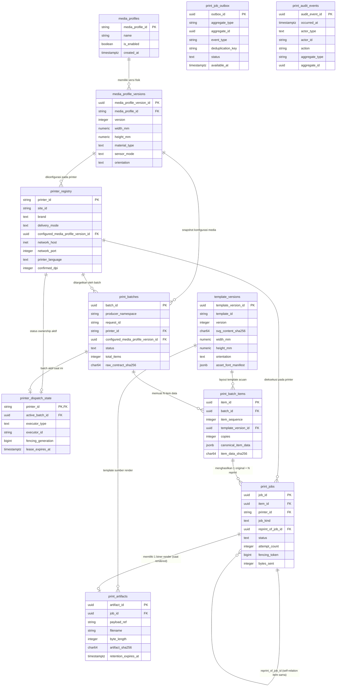

# Arsitektur Persistensi dan Desain Skema PostgreSQL v1

> - **Status Dokumen**: `PROPOSED` (Seluruh kasus pada validation harness saat ini lulus pada PostgreSQL 15.13 Disposable Container — Fase B2B2B.2)
> - **Tanggal Pembaruan**: 2026-09-18
> - **Target Database Engine**: PostgreSQL 15+ (Intranet Linux Server)
> - **Target Sistem**: Thermal Label Studio (Web Control Plane, Central Print Dispatcher, & Local Print Agent)
> - **Dokumen Terkait**:
>   - Skrip DDL Forward: [`docs/database/print_pipeline_v1.sql`](file:///c:/Users/fiqih/Documents/0000_TRST/Cline/0009_JSON_SVG_LABEL/web_app/docs/database/print_pipeline_v1.sql)
>   - Skrip DDL Rollback: [`docs/database/print_pipeline_v1_rollback.sql`](file:///c:/Users/fiqih/Documents/0000_TRST/Cline/0009_JSON_SVG_LABEL/web_app/docs/database/print_pipeline_v1_rollback.sql)
>   - Proposal Arsitektur: [`docs/architecture/production_architecture_options.md`](file:///c:/Users/fiqih/Documents/0000_TRST/Cline/0009_JSON_SVG_LABEL/web_app/docs/architecture/production_architecture_options.md)
>   - Kontrak Print Job v1: [`docs/contracts/print_job_v1.schema.json`](file:///c:/Users/fiqih/Documents/0000_TRST/Cline/0009_JSON_SVG_LABEL/web_app/docs/contracts/print_job_v1.schema.json)

---

## 1. Ringkasan Eksekutif (Executive Summary untuk Pengguna Non-Database)

Di lingkungan pabrik manufaktur dan logistik, proses pencetakan label barcode termal (seperti label gulungan bahan mentah dan stiker palet) adalah urat nadi produksi. Satu instruksi dari sistem enterprise **SAP** biasanya meminta pencetakan sekitar 30 lembar label fisik sekaligus dalam satu paket transaksi (**Print Batch**).

Sebelumnya, aplikasi *Thermal Label Studio* menyimpan antrean pekerjaan cetak hanya di memori komputer sementara (*in-memory*). Jika server restart, data cetak hilang, dan ada risiko label tercetak ganda jika koneksi jaringan tersendat.

Rancangan database **PostgreSQL v1** ini dibuat untuk menyelesaikan masalah tersebut dengan prinsip:
1. **Pencatatan Permanen Anti-Hilang**: Setiap pesanan cetak dari SAP langsung dicatat ke tabel permanen sebelum diproses.
2. **Kunci Anti-Duplikasi (*Idempotency Key*)**: Jika SAP mengirim ulang nomor pesanan yang sama karena sinyal tersendat, sistem mengenalinya dan tidak akan mencetak dua kali.
3. **Pemisahan Jelas 4 Pilar**: Sifat fisik kertas stiker (**Media Profile**), kemampuan mesin cetak (**Printer Profile**), gambar layout label (**Template Version**), dan berkas biner instruksi printer (**Artifact**) disimpan secara terpisah dan rapi.
4. **Pencegahan Kertas Tertukar (*No Interleaving*)**: Di setiap printer fisik, sistem menjamin pesanan cetak berjalan terurut nomor 1 sampai 30. Pesanan orang lain dilarang menyela di tengah-tengah gulungan stiker yang sedang dicetak.
5. **Keamanan Ekstra Saat Gangguan**: Jika printer kehabisan kertas di tengah jalan (misalnya pada label nomor 14), sistem otomatis menghentikan sementara sisa label (nomor 15 sampai 30) agar urutan nomor seri tidak rusak. Operator memeriksa fisik kertas sebelum memutuskan untuk melanjutkan atau mencetak ulang (*reprint*).

> **Pemberitahuan Batasan Fase**: *Dokumen ini adalah spesifikasi rancangan arsitektur data berstatus PROPOSED di mana seluruh kasus pada validation harness saat ini lulus pada container disposable PostgreSQL 15.13 (`postgres:15-bullseye`). Concurrency repository, privilege role, migration upgrade, backup/restore, dan production deployment belum diuji. DECISIONS.md saat ini hanya memuat ADR-001 sampai ADR-009. ADR-010 sampai ADR-023 masih merupakan kandidat PROPOSED yang didokumentasikan di production_architecture_options.md dan belum dipromosikan ke DECISIONS.md.*

---

## 2. Diagram Hubungan Entitas (Entity-Relationship Diagram)

> **Catatan Validasi Sintaks**: *Diagram Mermaid di bawah telah diverifikasi melalui manual syntax review (bukan parser-verified otomatis) untuk memastikan kepatuhan visualisasi.*



---

## 3. Daftar Tabel dan Kepemilikan Data (*Data Ownership*)

| Nama Tabel | Fungsi & Definisi Entitas | Komponen Pengelola / Penulis Utama | Kebijakan Mutasi |
| :--- | :--- | :--- | :--- |
| `media_profiles` | Identitas logis profil media stiker/kertas. | Label Administrator (Admin UI / RBAC) | INSERT / UPDATE (`is_enabled`) |
| `media_profile_versions` | Spesifikasi fisik media murni (dimensi, material, sensor). | Label Administrator (Admin UI / RBAC) | **Append-only untuk application roles** (Hanya INSERT versi baru) |
| `template_versions` | Desain kanvas digital SVG, hash konten, dan opaque content reference. | Studio Designer / Sync Tooling | **Append-only untuk application roles** (Hanya INSERT versi baru) |
| `printer_registry` | Master data printer, IP/Port, mode pengiriman, dan konfigurasi. | IT Infra / System Admin (Admin-Only RBAC) | INSERT / UPDATE oleh Admin |
| `printer_dispatch_state` | Kunci kepemilikan pengiriman aktif per printer fisik. | Delivery Executor / Central Dispatcher | INSERT / UPDATE atomik (lease management) |
| `print_batches` | Paket permintaan cetak induk dari produser SAP. | Ingestion Service (FastAPI Control Plane) | INSERT saat terima, UPDATE status transisi |
| `print_batch_items` | Baris data label unik di dalam batch (1 data = 1 baris). | Ingestion Service (FastAPI Control Plane) | INSERT saat terima batch, UPDATE status item |
| `print_jobs` | Unit eksekusi cetak fisik (state machine 10 status). | Worker Render & Delivery Dispatcher | INSERT saat batch dibuat, UPDATE state flow |
| `print_artifacts` | Metadata biner artefak cetak (ZPL/IPL) yang disimpan sementara. | Render Worker Pool | **Append-only untuk application roles** (INSERT sekali setelah render selesai) |
| `print_job_outbox` | Antrean tugas transaksional internal (pola Outbox). | Ingestion API & Render Worker | INSERT saat transaksi, UPDATE saat klaim/selesai |
| `print_audit_events` | Buku besar hukum audit permanen jejak operasional. | Seluruh Komponen Sistem (Audit Emitter) | **Append-only untuk application roles** (SELECT/INSERT; DBA tetap berwenang) |

---

## 4. Matriks Penegakan 13 Invarian (*13 Invariants Enforcement Matrix*)

Untuk menjaga transparansi teknis radikal, tabel berikut memetakan lapisan penegakan aktual untuk seluruh 13 invarian yang dibekukan pada Fase B2B2A.4:

| No | Nama Invarian B2B2A.4 | Lapisan Penegakan Utama | Mekanisme Teknis di Skema Database | Analisis Kesenjangan (*Gap*) & Penegakan Aplikasi |
| :--- | :--- | :--- | :--- | :--- |
| 1 | **Idempotensi Producer** | `DATABASE CONSTRAINT` | `UNIQUE (producer_namespace, request_id)` pada tabel `print_batches`. | Database menjamin penolakan duplikat. Nilai `producer_namespace` wajib divalidasi oleh service autentikasi (bukan dari payload bebas). |
| 2 | **Keterikatan Batch Tunggal** | `DATABASE CONSTRAINT` | `FOREIGN KEY (printer_id)` dan `FOREIGN KEY (configured_media_profile_version_id)`. | Menjamin bahwa satu batch hanya merujuk ke satu printer fisik dan satu versi spesifikasi media yang ada. |
| 3 | **Integritas Sekuensial Item** | `DATABASE CONSTRAINT` + `TRANSACTION RULE` | `UNIQUE (batch_id, item_sequence)` dan `CHECK (item_sequence > 0)`. | **Gap**: CHECK row tunggal tidak bisa menjamin deret tanpa lompatan (*gapless* 1..N). Ketiadaan lompatan diverifikasi oleh service sebelum commit. |
| 4 | **Relasi Item ke Minimal 1 Job** | `TRANSACTION / REPOSITORY RULE` | Tidak dapat dijamin oleh foreign key biasa tanpa membuat ketergantungan sirkular (*chicken-and-egg*). | Service menjamin dalam satu transaksi atomik ingestion: pembuatan baris `print_batch_items` wajib disertai `INSERT print_jobs (job_kind='original')`. |
| 5 | **Jejak Cetak Ulang Abadi** | `DATABASE CONSTRAINT` + `DATABASE INDEX` + `SERVICE RULE` | `CHECK` job kind, larangan self-reference, dan composite FK menjamin item parent sama. | Partial unique index hanya menjamin **at most one** original per item. Minimal satu original, parent harus original root, dan larangan chain/cycle ditangani transaction/service rule. |
| 6 | **Kepemilikan Pengiriman Tunggal** | `DATABASE CONSTRAINT` + `TRANSACTION RULE` | `PRIMARY KEY (printer_id)` pada tabel `printer_dispatch_state` dengan kolom `fencing_generation`. | Satu baris per printer menjamin secara eksklusif hanya ada satu active batch. Klaim kepemilikan dilakukan via `FOR UPDATE` singkat di database. |
| 7 | **Riwayat Audit Append-Only** | `DATABASE TRIGGER/PRIVILEGE` | Trigger menolak `UPDATE` atau `DELETE` untuk application role; role hanya memperoleh `SELECT, INSERT`. | Table owner/DBA/superuser tetap memiliki authority darurat dan dapat bypass sebagian kontrol. |
| 8 | **Larangan Auto-Retry delivery_unknown** | `SERVICE / STATE MACHINE RULE` | Tidak dapat dicegah murni oleh DDL statis. | Query polling worker secara eksplisit mengecualikan job dengan status `delivery_unknown`. Transisi keluar dari status ini hanya boleh dipicu aksi operator berotorisasi. |
| 9 | **Semantik Parameter Copies** | `DATABASE CONSTRAINT` + `SERVICE DOMAIN RULE` | `DEFAULT 1` dan `CHECK (copies BETWEEN 1 AND 100)` pada tabel `print_batch_items`. | Database membatasi batas numerik (1..100). Service domain menjamin `copies` hanya menduplikasi lembar fisik identik, bukan membedakan data item. |
10 | **Isolasi Registry Endpoint** | `DATABASE CONSTRAINT` + `RBAC / OPERATIONAL RULE` | Tipe data `network_host INET`, `network_port INTEGER CHECK (1..65535)`. | Database memastikan format IP dan range port valid. Kebijakan keamanan melarang input IP dari SAP; resolusi dilakukan server-side via Admin RBAC. |
11 | **Disiplin Zona Waktu** | `DATABASE CONSTRAINT` | Tipe data `TIMESTAMPTZ` pada seluruh kolom waktu di semua tabel. | Database secara ketat menyimpan zona waktu (UTC). Aplikasi memperlakukan seluruh waktu sebagai ISO 8601 UTC. |
12 | **Standar Format Checksum** | `DATABASE CONSTRAINT` | `CHECK (column ~ '^[a-f0-9]{64}$')` pada seluruh kolom SHA-256 (`raw_contract_sha256`, `item_data_sha256`, dll.). | Database menjamin integritas format hash (tepat 64 karakter heksadesimal huruf kecil). |
13 | **Validasi Atomik Sebelum Antrean** | `SERVICE / TRANSACTION RULE` | Tidak dapat dilakukan oleh database sebelum data dikirim. | Ingestion pipeline memvalidasi kecocokan seluruh 30 item terhadap template dan media fisik sebelum membuka transaksi penulisan database (*All-or-Nothing*). |

---

## 5. Siklus Hidup Entitas Data (*Lifecycle State Machines*)

### A. Siklus Status Batch (`print_batches.status`)
```
[SAP Ingestion]
       │
       ▼
   accepted ───────► processing ───────► completed
       │                  │
       │                  ├───► paused ───► (Resume oleh Operator) ───► processing
       │                  │       │
       │                  │       └───► cancelled
       │                  │
       │                  └───► partially_failed
       ▼
   cancelled
```
- **`accepted`**: Seluruh 30 item berhasil divalidasi dan dicatat permanen di database.
- **`processing`**: Sedang dalam proses render atau streaming socket ke printer.
- **`completed`**: Seluruh item dalam batch telah berstatus `sent_to_printer`.
- **`paused`**: Dijeda otomatis karena terjadi kegagalan transmisi/`delivery_unknown` pada salah satu item, atau dijeda manual oleh operator.
- **`partially_failed`**: Batch selesai diproses namun terdapat item yang gagal permanen.
- **`cancelled`**: Dibatalkan oleh supervisor pabrik sebelum tuntas.

### B. Siklus Status Pekerjaan Cetak Fisik (`print_jobs.status`)
Mematuhi secara ketat 10 status pada kontrak [`print_job_v1.schema.json`](file:///c:/Users/fiqih/Documents/0000_TRST/Cline/0009_JSON_SVG_LABEL/web_app/docs/contracts/print_job_v1.schema.json):
```
accepted ──► rendered ──► queued ──► claimed ──► sending ──► sent_to_printer
   │             │           │          │           │
   │             │           │          │           ├──► delivery_unknown (PAUSE BATCH)
   │             │           │          │           │
   ▼             ▼           ▼          ▼           ▼
cancelled     cancelled   cancelled   failed      failed
```
- **Aturan Mutlak Transisi**:
  1. Job yang berada pada status `sending` **DILARANG DI-AUTO-REQUEUE** saat lease expired.
  2. Status `sent_to_printer` dan `delivery_unknown` **TETAP MEMPERTAHANKAN** kolom `claimed_at`, `executor_type`, `executor_id`, dan `fencing_token` untuk jejak audit.

### C. Siklus Status Outbox (`print_job_outbox.status`)
```
pending ──► publishing ──► published
   │              │
   ▼              ▼
 failed ◄─────────┘
```

---

## 6. Batasan Transaksi dan Isolasi Jaringan (*Transaction Boundaries*)

Salah satu risiko terbesar pada arsitektur pencetakan industri adalah **Database Connection Starvation**. Jika sebuah proses membuka transaksi database dan menahan baris (*row lock*) sambil melakukan koneksi jaringan (*socket I/O*) ke printer yang sedang macet, koneksi database pool akan terkuras habis dalam hitungan detik.

Oleh karena itu, sistem menetapkan aturan arsitektur transaksi yang tidak dapat ditawar:
> **ATURAN MUTLAK**: Operasi transmisi jaringan (pembukaan RAW TCP socket Port 9100 atau streaming byte data) **DILARANG KERAS BERADA DI DALAM TRANSAKSI DATABASE ROW LOCK**.

### Pola Eksekusi Tiga Tahap Transaksi Singkat:

```
[Transaksi Database 1: Reserve dan claim singkat] (durasi illustrative; wajib diukur)
   ├── BEGIN
   ├── SELECT printer_dispatch_state FOR UPDATE
   ├── Verifikasi batch aktif dan item_sequence berikutnya pada printer yang sama
   ├── UPDATE printer_dispatch_state SET active_batch_id = ..., fencing_generation = fencing_generation + 1
   ├── UPDATE print_jobs SET status = 'claimed', executor_..., lease_... WHERE status = 'queued'
   └── COMMIT (Koneksi database dilepas kembali ke pool!)

[Executor menerima job claimed; begin_delivery menjadi transaksi kedua]
   ├── BEGIN
   ├── Verifikasi claim/fencing token
   ├── UPDATE print_jobs SET status = 'sending', attempt_count = attempt_count + 1 WHERE status = 'claimed'
   └── COMMIT (Tidak menahan row lock selama network I/O)

[Operasi Jaringan Murni: Di Luar Database Lock] (durasi bergantung lingkungan)
   ├── Baca biner artefak dari Durable Filesystem Volume
   ├── Verifikasi lokal SHA-256
   ├── Buka transport sesuai trusted printer registry
   ├── Tulis stream biner dengan timeout yang dikonfigurasi
   └── Catat bytes_sent aktual

[Transaksi Database 3: Lapor hasil singkat] (durasi illustrative; wajib diukur)
   ├── BEGIN
   ├── Verifikasi fencing_generation / token di DB masih valid
   ├── UPDATE print_jobs SET status = 'sent_to_printer' (atau 'delivery_unknown'), bytes_sent = ...
   ├── INSERT INTO print_audit_events (...)
   └── COMMIT
```

Query claim wajib memfilter printer/batch yang sama dan mengambil item dengan
`item_sequence ASC`, bukan mengambil arbitrary queued job. Semua network I/O
berlangsung setelah commit; row lock tidak dipertahankan selama pengiriman.

---

## 7. Keterbatasan Fencing Token pada Printer RAW TCP

Untuk mencegah miskonsepsi keamanan, dokumen ini menegaskan fakta teknis perangkat keras:
1. **Printer Industri RAW TCP Tidak Memiliki Logika Fencing**: Printer termal Zebra atau Intermec/Honeywell pada Port 9100 adalah soket pasif biner. Printer tidak memiliki mekanisme penolakan token seperti cluster etcd atau ZooKeeper. Sekali data ZPL/IPL masuk ke buffer memori printer, mesin akan mencetaknya ke kertas fisik.
2. **Peran Fencing Token Terbatas pada Layer Database**: Fencing token (`fencing_generation` / `fencing_token`) hanya berfungsi:
   - Menolak *stale worker* sebelum pengiriman fisik dimulai;
   - Melindungi integritas status di tabel database PostgreSQL;
   - Menolak laporan status dari worker lama yang mengalami *network partition*.
3. **Konsekuensi Invarian**:
   - Jika worker A terputus saat streaming data dan worker B mengambil alih, **risiko pencetakan label duplikat fisik tidak dapat dihilangkan hanya dengan fencing token**.
   - Oleh sebab itu, sistem menerapkan aturan: **Status `sending` dilarang auto-requeue!** Ketika terjadi kecurigaan putus koneksi pada status `sending`, job dialihkan ke `delivery_unknown` dan sisa batch di-pause untuk inspeksi fisik manusia.

---

## 8. Rasionalisasi dan Justifikasi Indeks Database

Setiap indeks yang dirancang dalam skrip DDL didasarkan pada jalur query (*query path*) nyata dan tidak redundan:

1. **`uq_print_batches_producer_request` (`producer_namespace`, `request_id`)**:
   - *Jenis*: Unique Constraint (B-Tree).
   - *Query Path*: Pengecekan idempotensi instan saat request batch SAP masuk ($O(1)$ lookup).
2. **`idx_print_batches_status_created` (`status`, `created_at ASC`)**:
   - *Query Path*: Dashboard monitoring operasional untuk melihat batch yang sedang aktif atau tertahan (`paused`).
3. **`uq_print_batch_items_sequence` (`batch_id`, `item_sequence`)**:
   - *Jenis*: Unique Constraint (B-Tree).
   - *Query Path*: Mengambil item terurut per batch dan mencegah duplikasi sequence.
4. **`idx_print_jobs_printer_status_created` (`printer_id`, `status`, `created_at ASC`)**:
   - *Query Path*: Central Print Dispatcher mengambil job siap kirim (`status = 'queued'`) untuk printer tertentu secara serial.
5. **`uq_print_jobs_single_original_per_item` (`item_id`) WHERE (`job_kind = 'original'`)**:
   - *Jenis*: Partial Unique Index.
   - *Query Path*: Menegakkan batas maksimal satu original job per item tanpa membatasi jumlah record reprint.
6. **`idx_print_jobs_lease_expiry` (`status`, `lease_expires_at`) WHERE `status IN ('claimed', 'sending')`**:
   - *Jenis*: Partial Index.
   - *Query Path*: Background reaper mendeteksi job yang klaimnya kedaluwarsa secara cepat tanpa full table scan.
7. **`idx_print_job_outbox_pending_available` (`available_at ASC`, `created_at ASC`) WHERE (`status = 'pending'`)**:
   - *Jenis*: Partial Index.
   - *Query Path*: Render Worker Pool mengklaim task outbox menggunakan teknik `SELECT ... FOR UPDATE SKIP LOCKED`.
8. **`idx_print_artifacts_retention_expiry` (`retention_expires_at ASC`)**:
   - *Jenis*: B-Tree Index.
   - *Query Path*: Maintenance cron job membersihkan artefak biner yang melewati masa retensi (7–30 hari).
9. **`idx_print_audit_events_aggregate_time` (`aggregate_type`, `aggregate_id`, `occurred_at ASC`)**:
   - *Query Path*: Penelusuran riwayat audit hukum lengkap untuk suatu `job_id` atau `batch_id`.

---

## 9. Kebijakan Penghapusan Data dan Retensi (*Delete & Retention Policy*)

1. **Larangan Keras `ON DELETE CASCADE`**: Seluruh foreign key relasional pada tabel batch, item, job, media profile version, template version, dan audit menggunakan aturan **`ON DELETE RESTRICT`**. Tidak boleh ada penghapusan data transaksional yang terjadi secara otomatis sebagai efek samping penghapusan baris lain.
2. **Pembersihan Artefak Biner Sementara**:
   - Tabel `print_artifacts` memuat kolom `retention_expires_at`.
   - Pembersihan biner di Durable Volume / MinIO dilakukan oleh scheduled job resmi melalui referensi `payload_ref`.
   - Menghapus biner artefak kadaluwarsa **tidak menghapus** baris transaksi di `print_jobs` maupun `print_audit_events`.
3. **Data Audit Permanen**: Tabel `print_audit_events` tidak memiliki mekanisme delete dan dilindungi trigger database.

---

## 10. Asumsi Pencadangan dan Penggunaan Skrip Rollback

### A. Kebijakan Pencadangan (Backup Policy)
- PostgreSQL WAL berjalan kontinu; cadence archive, retention, RPO, dan RTO masih **ASSUMPTION** yang harus disepakati IT Infrastruktur.
- Folder penyimpanan berkas biner artefak di-backup bersamaan dengan metadata snapshot database.

### B. Batasan Penggunaan Skrip Rollback (`print_pipeline_v1_rollback.sql`)
- Berkas skrip rollback disediakan semata-mata untuk **lingkungan pengujian lokal / disposable test database**.
- **PERINGATAN KERAS**: Dilarang keras mengeksekusi skrip rollback pada database production atau staging karena akan memusnahkan seluruh riwayat kepatuhan audit pabrik.
- Skrip rollback tidak dieksekusi pada fase ini.

---

## 11. Pemetaan Skema Database ke Kontrak `print_job_v1.schema.json`

Skema database PostgreSQL v1 adalah **PROPOSED** dan tidak diklaim selaras 100% dengan kontrak JSON v1 [`docs/contracts/print_job_v1.schema.json`](file:///c:/Users/fiqih/Documents/0000_TRST/Cline/0009_JSON_SVG_LABEL/web_app/docs/contracts/print_job_v1.schema.json). Adapter service diperlukan karena JSON `claim` memakai `agent_id`, sedangkan database menyimpan `executor_type`, `executor_id`, `claimed_at`, `lease_expires_at`, dan `fencing_token`.

| Properti Kontrak JSON v1 | Representasi Kolom PostgreSQL | Keterangan Pemetaan |
| :--- | :--- | :--- |
| `contract_version` | Tersimpan di `print_batches.source_metadata->>'contract_version'` | Selalu `1.0` untuk kontrak v1. |
| `job_id` | `print_jobs.job_id` (UUID) | Primary Key string UUID format standar. |
| `request_id` | `print_batches.request_id` (VARCHAR) | Diambil melalui relasi `item_id -> batch_id`. |
| `created_at` | `print_jobs.created_at` (TIMESTAMPTZ) | Timestamp ISO 8601 UTC. |
| `expires_at` | `print_jobs.expires_at` (TIMESTAMPTZ) | Batas waktu kedaluwarsa job. |
| `site_id` | `printer_registry.site_id` (VARCHAR) | Di-resolve melalui relasi `printer_id`. |
| `printer_id` | `print_jobs.printer_id` (VARCHAR) | Foreign key ke `printer_registry`. |
| `printer_language` | `printer_registry.printer_language` (TEXT) | Di-resolve dari registry (`zpl` atau `ipl`). |
| `emulation` | `printer_registry.emulation` (TEXT) | Di-resolve dari registry (`native` atau `zsim2`). |
| `dpi` | `printer_registry.confirmed_dpi` (INTEGER) | Resolusi fisik titik per inci terkonfirmasi. |
| `copies` | `print_batch_items.copies` (INTEGER) | Diambil dari baris item (default: 1, max: 100). |
| `artifact` | `print_artifacts` (Baris metadata terpisah) | Relasi 1:1 via `job_id`. Null saat `accepted`. |
| `artifact_sha256` | `print_artifacts.artifact_sha256` (CHAR(64)) | Checksum lowercase 64 hex. |
| `status` | `print_jobs.status` (TEXT CHECK) | 10 status identik dengan enum JSON schema. |
| `attempt_count` | `print_jobs.attempt_count` (INTEGER) | Jumlah percobaan kirim fisik. |
| `last_error` | `print_jobs.last_error_code` (VARCHAR) | Kategori/kode error tersanitasi. |
| `claim` | Kolom `executor_type`, `executor_id`, `claimed_at`, `lease_expires_at`, `fencing_token` | Gateway/local agent memetakan `executor_id` ke `claim.agent_id`; central dispatcher belum memiliki representasi langsung pada kontrak v1. |
| `source` | `print_batches.source_metadata` (JSONB) | Metadata asal program/user SAP. |

---

## 12. Hal-Hal yang Belum Diimplementasikan (*Deferred Work*)

Untuk menjaga transparansi radikal sesuai aturan quality gate:
1. **Tidak Ada Database Production/Staging Permanen**: DDL ini belum di-deploy ke database production/staging permanen (baru diverifikasi pada disposable container PostgreSQL 15.13).
2. **Tidak Ada ORM / Migration Tool**: Belum ada library SQLAlchemy, Alembic, psycopg, atau Prisma yang dipasang ke `requirements.txt`.
3. **Tidak Ada Runtime Code yang Berubah**: Source code backend FastAPI, unit test, dan adapter runner belum dihubungkan ke database.
4. **Transport RAW TCP Masih Mock**: Pengiriman biner nyata ke Port 9100 printer fisik belum diimplementasikan.
5. **RabbitMQ dan MinIO Ditangguhkan**: Sistem pilot menggunakan PostgreSQL Outbox dan Durable Linux Volume lokal.

Validation disposable tersedia di `docs/database/print_pipeline_v1_validation.sql`.
Script tersebut memakai fixture dalam satu transaction yang di-rollback dan
menangkap SQLSTATE serta `CONSTRAINT_NAME` yang diharapkan untuk setiap negative
case. Fixture reprint memiliki original root valid dan setiap case mengubah satu
invariant target saja. Script tidak menyediakan koneksi printer.

**Status Eksekusi**: Seluruh kasus pada validation harness saat ini lulus pada instance PostgreSQL 15.13 disposable container (`postgres:15-bullseye`).
Forward DDL, validasi 33 negative test cases dengan expected-failure sentinels, rollback penuh tanpa CASCADE, dan clean re-apply dieksekusi dengan hasil `VALIDATION_PASS_IF_NO_ERROR`.

## 13. Status Contract, Batas Enforcement, dan Runtime Verification (Fase B2B2B.2)

Dokumen, DDL, dan rollback pada fase ini berstatus **PROPOSED**. Seluruh kasus pada validation harness saat ini lulus pada engine PostgreSQL 15.13 (`postgres:15-bullseye`) via Docker Desktop disposable container. Namun, status *runtime-verified* ini secara tegas **bukan** berarti *production-deployed* atau *production-ready*. Concurrency repository, privilege role, migration upgrade, backup/restore, dan production deployment belum diuji. DECISIONS.md saat ini hanya memuat ADR-001 sampai ADR-009. ADR-010 sampai ADR-023 masih merupakan kandidat PROPOSED yang didokumentasikan di production_architecture_options.md dan belum dipromosikan ke DECISIONS.md.

### Invariant relasional dan lifecycle

- `print_batches(batch_id, printer_id)`, `print_batch_items(item_id, batch_id)`,
  dan composite foreign key pada `print_jobs` mengikat item serta job ke printer
  batch yang sama. `printer_dispatch_state` memakai composite FK yang sama.
- `accepted`, `rendered`, dan `queued` wajib kosong pada field claim/executor.
  `claimed`, `sending`, `sent_to_printer`, dan `delivery_unknown` wajib memiliki
  executor, claim time, lease, dan fencing token. Status terminal boleh
  mempertahankan atau mengosongkan histori claim.
- CHECK hanya memvalidasi row saat ini. Legal transition
  `queued -> claimed -> sending -> sent_to_printer/failed/delivery_unknown`,
  lease recovery, dan monotonic `fencing_generation` adalah aturan repository/
  service dalam transaksi; CHECK tidak membuktikan urutan histori.
- `sending` dan final delivery state memerlukan `attempt_count >= 1`.
  `expires_at > created_at`, lease melebihi claim time, dan `bytes_sent >= 0`.
- Partial unique index berarti **at most one** original per item. Minimal satu
  original dibuat dalam satu transaction ingestion. Reprint selalu row baru,
  menunjuk original root; service memeriksa parent original dan mencegah chain
  atau cycle karena FK biasa tidak cukup untuk itu.

### Printer, artifact, dan template

- `central_tcp` memerlukan host/port dan tidak boleh memiliki gateway executor;
  `gateway_agent` tidak menyimpan endpoint network pada control-plane dan wajib
  memiliki gateway executor; `legacy_bridge` memakai `trusted_bridge_id` dan
  tidak boleh mencampur endpoint lain. Port 1..65535 adalah constraint; allowlist
  9100 tetap service/configuration rule.
- Artifact memakai `payload_ref` opaque, media type octet-stream, ukuran 1..10
  MiB, checksum lowercase 64 hex, dan retention setelah creation. Filename dan
  `printer_language_snapshot` memiliki CHECK lokal. Keberadaan artifact untuk
  status rendered dan sesudahnya adalah service transaction rule karena CHECK
  tidak dapat menjangkau tabel lain.
- `template_versions.svg_payload_ref` adalah referensi opaque immutable ke
  konten SVG trusted, disertai hash. Deterministic re-render belum dapat
  diklaim bila payload, font, atau asset tidak dapat diambil kembali.
- Version rows media/template dan metadata artifact diperlakukan append-only
  untuk application roles: tidak ada UPDATE/DELETE privilege. Trigger audit
  melindungi application path, tetapi table owner/DBA/superuser tetap dapat
  bypass sebagian kontrol. Penghapusan binary karena retention tidak menghapus
  metadata transaksi.

### Outbox dan waktu

`pending` tidak memiliki claim/published time, `publishing` memiliki claimant dan
lease tanpa published time, dan `published` memiliki published time. Index polling
menyusun `available_at, created_at` untuk status pending. Publish/network I/O
berlangsung di luar row lock. `updated_at` wajib ditulis repository pada setiap
mutasi; DEFAULT hanya mengisi insert dan bukan auto-update.

Pada desain ini claim outbox dibersihkan seluruhnya saat `published`. Status
`failed` boleh tanpa claim atau mempertahankan claim lengkap, tetapi tidak boleh
menyimpan partial claim. Aturan ini memelihara audit tanpa menganggap CHECK dapat
membuktikan histori transisi.

### Mapping kontrak v1

Kontrak JSON v1 tetap tidak diubah. Adapter service memetakan
`executor_id -> claim.agent_id` untuk gateway/local agent. Central dispatcher
belum memiliki representasi langsung pada claim v1 sehingga memerlukan adapter
atau kontrak v2 yang masih **PROPOSED**. `source_metadata` JSONB juga harus
divalidasi oleh service/Pydantic sebelum insert; JSONB sendiri tidak menegakkan
shape strict.

## 14. Koreksi B2B2B.2.2 — Expected-Failure Sentinel pada Harness Validation

Pada Fase 2.3B2B2B.2.2, skrip pengujian validasi isolasi `docs/database/print_pipeline_v1_validation.sql` disempurnakan untuk mengeliminasi risiko *false-positive* pada seluruh 33 negative test cases.

### Masalah False-Positive pada Pola Exception Pasif
Sebelum perbaikan ini, setiap blok pengujian negatif mengecek `SQLSTATE` dan `CONSTRAINT_NAME` hanya jika exception terjadi (`EXCEPTION WHEN ... THEN`). Jika skrip SQL yang cacat (misalnya `INSERT`/`UPDATE`/`DELETE` tidak valid) ternyata diterima oleh database tanpa melempar exception (misal constraint belum dibuat atau tidak aktif), blok `BEGIN ... END` selesai secara normal. Akibatnya, transaksi berlanjut tanpa error dan harness mencapai marker sukses akhir `VALIDATION_PASS_IF_NO_ERROR`, yang merupakan *false positive*.

### Mekanisme Expected-Failure Sentinel
Untuk menegakkan kegagalan aktif (*fail-fast*), setiap blok dari tepat 33 negative test cases dipasangi sentinel exception `P0001` tepat setelah pernyataan yang seharusnya gagal di dalam inner `BEGIN`:

```sql
DO $$
DECLARE
    actual_constraint TEXT;
BEGIN
    BEGIN
        INSERT INTO ... invalid ...;

        RAISE EXCEPTION
            USING ERRCODE = 'P0001',
                  MESSAGE = 'expected violation was not raised: <nama test>';
    EXCEPTION
        WHEN check_violation THEN
            GET STACKED DIAGNOSTICS
                actual_constraint = CONSTRAINT_NAME;

            IF SQLSTATE <> '<expected SQLSTATE>'
               OR actual_constraint IS DISTINCT FROM '<expected constraint>'
            THEN
                RAISE;
            END IF;
    END;
END $$;
```

### Invarian dan Karakteristik Eksekusi Sentinel:
1. **Pemisahan Kelas Exception**:
   - Klausul `EXCEPTION WHEN` hanya menangkap kelas exception yang diharapkan dari constraint database:
     - `check_violation` (SQLSTATE `23514`)
     - `foreign_key_violation` (SQLSTATE `23503`)
     - `unique_violation` (SQLSTATE `23505`)
     - `restrict_violation` (SQLSTATE `23001`, khusus trigger proteksi audit)
   - Sentinel error `P0001` (`raise_exception`) **secara sengaja tidak ditangkap** oleh blok handler tersebut.
   - Tidak ada handler `WHEN OTHERS` dan tidak ada penangkapan `raise_exception` / `P0001`.
2. **Perilaku Bila Statement Invalid Diterima**:
   - Jika statement invalid berhasil dieksekusi tanpa error, alur kontrol langsung mencapai `RAISE EXCEPTION USING ERRCODE = 'P0001'`.
   - Karena error ini tidak ditangkap oleh handler spesifik, exception langsung lolos ke tingkat sesi.
   - Dengan direktif `\set ON_ERROR_STOP on`, klien `psql` akan segera menghentikan eksekusi script dan transaksi dibatalkan sebelum mencapai marker akhir `VALIDATION_PASS_IF_NO_ERROR`.
3. **Verifikasi Eksak Saat Exception Terjadi**:
   - Jika statement invalid memang gagal sebagaimana mestinya, engine PostgreSQL langsung melompat ke blok `EXCEPTION`, sehingga sentinel `P0001` dilewati.
   - Di dalam handler, `GET STACKED DIAGNOSTICS actual_constraint = CONSTRAINT_NAME;` memeriksa apakah `SQLSTATE` dan nama constraint persis sama dengan yang diharapkan. Jika berbeda (misal gagal karena constraint lain yang tidak relevan), exception dilempar kembali (`RAISE;`) dan eksekusi script dihentikan.
4. **Proteksi Audit Event**:
   - Pada pengujian `UPDATE` dan `DELETE` audit, baris fixture dipastikan ada terlebih dahulu (`SELECT count(*) INTO found_count ...`), mutasi dicoba, sentinel disiagakan di baris berikutnya, dan handler hanya menangkap `restrict_violation` dengan pengecekan eksak `SQLSTATE = '23001'` serta `CONSTRAINT_NAME = 'trg_protect_audit_events'`.
5. **Status Eksekusi PostgreSQL**:
   - Seluruh kasus pada validation harness saat ini lulus pada instance disposable PostgreSQL 15.13 (`postgres:15-bullseye`).
   - Forward DDL (`print_pipeline_v1.sql`) berhasil membuat 11 tabel, function, trigger, dan seluruh index tanpa error.
   - Validation harness (`print_pipeline_v1_validation.sql`) berhasil mengeksekusi seluruh fixture positif, 33 negative test cases ber-sentinel, dan menghasilkan output `VALIDATION_PASS_IF_NO_ERROR` sebelum `ROLLBACK`.
   - Rollback DDL (`print_pipeline_v1_rollback.sql`) berhasil menghapus seluruh 11 tabel, trigger, dan function secara bersih tanpa `CASCADE` (menghasilkan "Did not find any relations").
   - Clean re-apply (`print_pipeline_v1.sql` + `print_pipeline_v1_validation.sql`) sukses dieksekusi ulang membuktikan repeatability pada database bersih dan kelengkapan skrip rollback; forward DDL bukan bersifat idempotent terhadap skema yang sudah terpasang melainkan fail-fast.
   - Concurrency repository, privilege role, migration upgrade, backup/restore, dan production deployment belum diuji.
