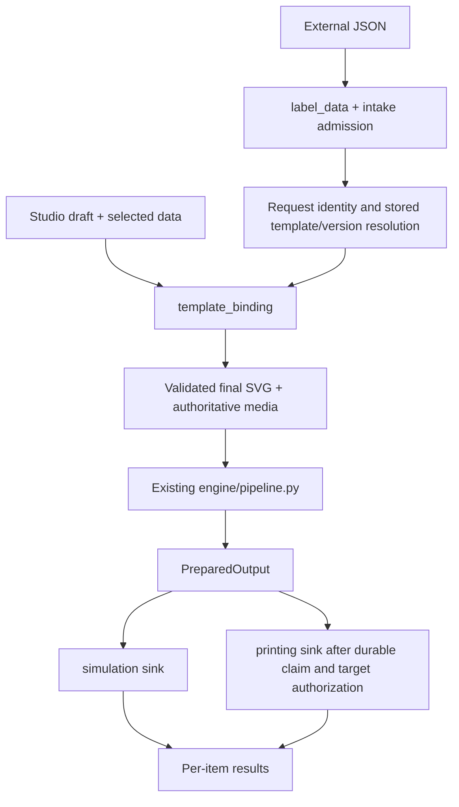

# Universal label pipeline implementation

Created: 2026-10-10 (Asia/Jakarta).
Status: T01 and T02 DONE with independent review PASS. This package authorizes no external delivery, deployment or publication by itself.
Execute a task when the user asks to execute that task. Do not implement the entire roadmap in one AI turn.
The task package was created earlier. The user subsequently authorized T01 and then T02. [BASELINE](BASELINE.md), [CONTRACT](CONTRACT.md), [PARITY_MATRIX](PARITY_MATRIX.md), [T01 result](results/T01_RESULT.md) and [independent review](results/T01_REVIEW.md) record the accepted design. [T02 result](results/T02_RESULT.md) and [T02 review PASS](results/T02_REVIEW.md) record canonical admission and local sample handling. T03 is eligible and unstarted.

## Objective

Provide universal label intake using the latest Studio JSON format, a server-owned template binding path shared by Studio output and external intake, and the existing raster/IPL/simulation/print engine.
An external sender can be SAP, MES or another application. New feature names, endpoint contracts and orchestration must use universal terminology.
Existing sap fixture modules remain clearly historical; do not delete/rename working fixture code just for naming consistency.

## Read first

1. Root [AGENTS.md](../../../AGENTS.md).
2. Current active [architecture](../../ARCHITECTURE.md), [API contract](../../API_CONTRACT.md), [product flow](../../PRODUCT_FLOW.md), [decisions](../../DECISIONS.md), [development](../../DEVELOPMENT.md).
3. [Accepted decisions and unresolved choices](DECISIONS.md).
4. [Status and handoff](STATUS.md).
5. The selected task, prerequisite result/review files, and its actual source pointers.

Paths in tasks are repository-relative unless stated otherwise. Run backend commands from the repository root and frontend commands from frontend/.
The earlier workspace-level PIPELINE_ANALYSIS_2026-10-09.md is dated supporting evidence, not current implementation proof.
Re-read actual source at the start of each task. The worktree was already dirty when this package was created; preserve unrelated edits.

## Accepted requirements

- Latest versionless envelope: sender, request_id, required mode, optional field_descriptions, ordered items.
- mode is simulation or print for the whole request.
- Each item contains unique item_id, label_code, copies (strict integer 1–999), and scalar/null data.
- Data Tokens remains an editor feature. It does not listen to external requests or change the selected Studio dataset when intake runs.
- Importing a JSON file with mode=print never prints automatically.
- Studio output submits the current draft and explicit data to server binding. Intake resolves a stored template by label_code and pins the exact version/checksum.
- Equal template content, data and processing parameters must yield equal bound semantics, raster pixels and IPL bytes. Draft and stored templates can legitimately differ.
- Reuse engine/pipeline.py, resvg, IPL codec, PreparedOutput and the existing final sinks.
- Print submission remains unconfirmed. No automatic retry on uncertain delivery, response loss or crash.
- Exact technical keys, business values and barcode/QR payloads are preserved. Descriptions are presentation metadata.
- Missing, null, empty, zero and false remain distinct. An unresolved required binding fails closed.
- A published saved template is not automatically an approved external-print template.

## Target boundaries

```text
backend/app/
  label_data/          # Shared external envelope/data contract
  label_intake/        # Universal HTTP intake, orchestration, results, request ledger
  template_binding/    # Studio SVG metadata, validation, text/composition/barcode/QR binding
  layouts/             # Existing immutable versioned template storage
  engine/              # Existing preparation/raster/output
  protocols/           # Existing IPL encoder/decoder
  simulation/          # Existing prepared-output PNG sink
  printing/            # Existing one-attempt transport sink
  studio_datasets/     # Existing editor sample storage using shared validation
```

Do not create empty architecture shells for every file listed. Add modules when the selected task consumes them.
Keep feature APIs narrow. Reuse by another feature does not transfer ownership into generic shared/utils folders.

## Target flow



Studio preview/print stays on the current editor endpoints. Do not restore legacy render/inspection routes.
T01 decides the universal intake endpoint and editor request shape, preserving one registered process contract rather than adding competing contracts at the same path.

## Task roadmap

| Task | Deliverable | Depends on | Execution boundary |
| --- | --- | --- | --- |
| [T01](tasks/T01_BASELINE_AND_CONTRACT.md) | Baseline, binding/API contracts, decision closure | None | Read source, create design artifacts; no application behavior changes |
| [T02](tasks/T02_CANONICAL_LABEL_DATA.md) | Shared JSON contract and Studio/dataset alignment | T01 | Local source/tests |
| [T03](tasks/T03_TEMPLATE_METADATA.md) | Validated Studio binding metadata/manifest | T01, T02 | Local source/tests |
| [T04](tasks/T04_TEXT_AND_COMPOSITION.md) | Server text/composition binding | T03 | Local source/tests |
| [T05](tasks/T05_BARCODE_AND_QR.md) | Server barcode/QR binding | T03, T04 | Local source/tests |
| [T06](tasks/T06_STUDIO_SHARED_OUTPUT.md) | Studio preview/print through server binding + parity | T02, T04, T05 | Source/mock browser/fake transport |
| [T07](tasks/T07_INTAKE_SIMULATION.md) | Universal stored-template intake simulation | T02, T03, T04, T05, T06 | Source/tests with injected storage |
| [T08](tasks/T08_DURABLE_REQUEST_IDENTITY.md) | Durable deduplication and recovery boundaries | T01, T07 | Source/schema/tests with fakes |
| [T09](tasks/T09_ADMISSION_AND_TARGET_POLICY.md) | Admission, approved templates and server target routing | T01, T07 | Source/policy/tests with fakes |
| [T10](tasks/T10_INTAKE_PRINT.md) | Universal print and unambiguous per-item outcomes | T06, T07, T08, T09 | Source/tests; no physical send |
| [T11](tasks/T11_SOURCE_AND_RUNTIME_ACCEPTANCE.md) | Main software acceptance and separate runtime evidence | T02–T10 | Source/parity checks; live storage/container checks require named authorization |
| [T12](tasks/T12_PHYSICAL_ACCEPTANCE.md) | Optional named printer/external-sender acceptance | T11 | Run only when requested; explicit named-target authorization required |

The default implementation sequence is T01 through T11 with one active writer. T12 is optional device/integration acceptance and does not block software feature acceptance. Dependency edges allow review preparation, not permission for parallel source writers.
If T04/T05 cannot support a current Studio feature, fail that feature explicitly and record NEEDS_REPLAN; do not silently fall back to captured sample text/image or a fixture binder.

## Software acceptance boundary

T11 is the main software acceptance gate. The simulation sink decodes the encoded IPL payload into PNG; acceptance must verify the prepared raster pixels against those decoded pixels and compare Studio/intake payload bytes for identical inputs and parameters.
Use independently specified IPL fixtures to catch an encoder/decoder mistake shared by both sides, and a fake transport or non-device recorder to prove exact bytes, one submission and native copies. A visually plausible preview alone is insufficient.

Physical printing is not required for software parity acceptance. T12 adds optional evidence about the named printer, media, calibration, physical quantity and scan results. An unexecuted T12 remains NOT RUN without blocking the software gate.
Live storage, durable restart recovery and packaged runtime retain their own evidence requirements in T11. Simulation/source PASS does not upgrade these operational gates or establish physical device readiness.

## AI handoff protocol

- Execute only the selected task. Inspect git status and diffs before editing.
- Write results/Txx_RESULT.md using [RESULT_TEMPLATE.md](RESULT_TEMPLATE.md).
- Review the actual diff and meaningful test evidence using [REVIEW_TEMPLATE.md](REVIEW_TEMPLATE.md); write results/Txx_REVIEW.md.
- A writer report alone does not complete the gate. Review may be performed by another explicitly assigned AI or by the user; this package does not spawn agents or chats.
- Update STATUS.md only with actual evidence. Dependencies require DONE + review PASS for the relevant scope.
- Use PENDING, IN_PROGRESS, DONE, BLOCKED, NEEDS_REPLAN for task state and PASS, FAIL, BLOCKED, PENDING, NOT RUN for evidence.
- Partial task completion does not upgrade downstream storage, print or deployment readiness.
- A blocked external check does not block unrelated source work. Record exactly which gate remains pending.

## Side-effect boundary

Implementing code is separate from running it against PostgreSQL/MinIO, external senders, printers or containers.
Use fakes/disposable local fixtures until the user authorizes a named target.
Do not initialize/migrate operational storage, create/delete/attach volumes, deliver to printers, access SAP, expose LAN ports, commit/push, or deploy based solely on this package.
Do not read/print credentials. Temporary reports/screenshots/traces use unique project .tmp/ children.
T11/T12 must record authorization evidence and target identity before effects; unexecuted checks remain NOT RUN.

## Copy-ready start prompt

```text
Execute T01 from docs/implementation/universal-label-pipeline/tasks/T01_BASELINE_AND_CONTRACT.md.
Read the package README, DECISIONS, STATUS, root AGENTS.md and current source.
Preserve existing changes, execute only this task, and honor the side-effect boundary.
Write results/T01_RESULT.md with evidence and remaining decisions. Do not begin T02 automatically.
```

For later tasks substitute the task ID and filename, and read prerequisite results/reviews.
