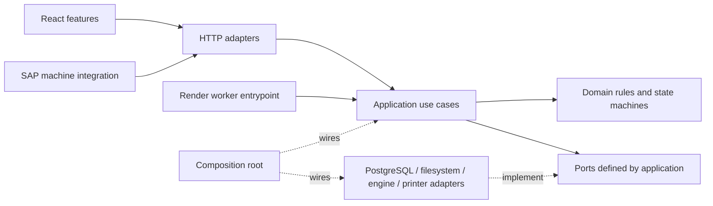
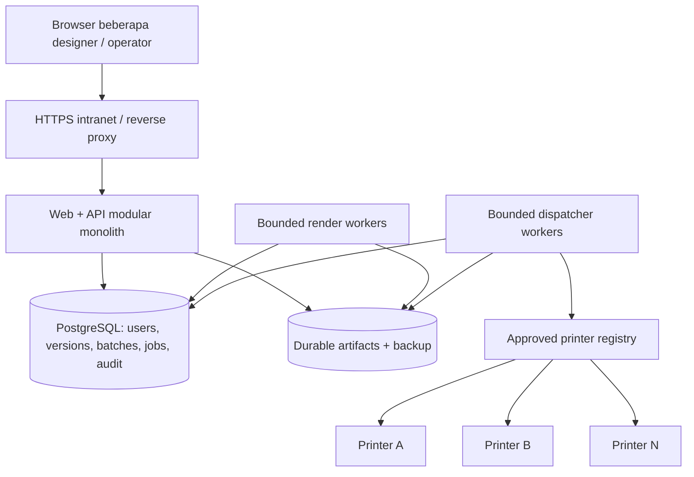

# Hasil audit arsitektur — 24 September 2026

## Keputusan yang direkomendasikan

Pertahankan React/Vite/FastAPI dan engine. Kembangkan menjadi **modular monolith dengan ports and adapters (Hexagonal Architecture)** pada batas yang memang membutuhkan isolasi: persistence, renderer, template/profile registry, job scheduling, clock, dan transport printer. Gunakan aturan dependency Clean Architecture tanpa mewajibkan empat lapisan dan interface untuk setiap fungsi.

Proyek sudah memiliki fondasi baik. Kebutuhan utama adalah memperjelas ownership, menutup jalur legacy yang melewati kontrol baru, dan menguji invariant lintas modul. Pemindahan folder saja tidak akan menyelesaikan masalah tersebut. Microservices belum didukung bukti kebutuhan kapasitas atau organisasi dalam audit ini.

**Target dikonfirmasi pengguna:** satu aplikasi di server perusahaan yang menangani banyak printer dan beberapa pengguna desain. Rekomendasi utama karena itu adalah satu produk/codebase dengan beberapa proses terkontrol pada server yang sama: web/API, render worker, dan dispatcher. Tidak membutuhkan multi-tenant atau layanan terpisah per printer.

Baseline: `main` / `b30e7a6670a4e281362e180f251e5e7250d362ca`, sama dengan `origin/main` setelah fetch. Semua referensi kode di bawah relatif terhadap root `web_app` dan mengacu baseline ini. Dokumentasi hasil bukan implementasi perbaikan.

## Fondasi yang dipertahankan

- Engine renderer/barcode/rasterizer/encoder sudah terpisah dari React.
- `print_jobs/repository.py:43,97` mendefinisikan protocol repository; adapter memory dan PostgreSQL sudah tersedia.
- Lifecycle print job, claim/lease, fencing, checksum artefak, dan recovery memiliki implementasi dan regression suite. Refaktor harus mempertahankan semantik tersebut.
- Auth memiliki abstraksi repository (`auth/repository.py:22`) dan SQLite WAL untuk penggunaan lokal; SQLite sendiri bukan bukti desain buruk.
- Raw SAP snapshot, schema validation, batas upload, idempotensi, warning per field, dan pemisahan strict/tolerant sudah menjadi konsep nyata.
- Frontend sudah memisahkan API modules dan banyak hook canvas; bundle sudah membagi vendor React/Fabric/icons serta lazy preview.
- Jenkins memiliki candidate-container safety checks dan mekanisme rollback lokal. Ini berguna, tetapi cakupan test belum sama dengan seluruh kontrak produk.

## Temuan yang diprioritaskan

Prioritas P1 berarti perlu ditangani sebelum memperluas penggunaan/deployment; P2 berarti penguatan penting sebelum pertumbuhan fitur atau concurrency. Ini bukan klaim bahwa semua risiko telah terjadi di deployment pengguna.

### A01 — P1: cleanup sementara dapat menghapus data simulasi durable

**REPRODUCED pada direktori sintetis.** `backend/app/services/cleanup_service.py:35-43` menghapus setiap child directory yang mtime-nya melewati TTL. `backend/app/main.py:61` mengaktifkan worker setiap 30 menit dengan TTL dua jam. Sementara `services/sap_shadow_service.py:342-355` menempatkan `simulation_batches` dan `simulation_artifacts` di bawah root output yang sama secara default.

Diagnostic membuat tiga folder berumur tiga jam dalam temporary directory baru, lalu memanggil fungsi cleanup aktual. Hasil: `cleanup_removed=3`, folder batch dan artefak sama-sama tidak tersisa. Tidak ada data aplikasi aktif yang digunakan. Ini membuktikan fungsi tidak membedakan storage sementara dan durable, bukan bukti data pengguna sudah terhapus. Mtime parent juga bukan usia tiap artefak: pembaruan file nested tidak selalu memperbarui mtime parent.

Perbaikan: root terpisah `ephemeral/render` dan `durable/simulation`; cleanup hanya menerima root ephemeral dan job directory yang dikenali. Retention durable berdasarkan metadata/expiry, status job, serta referensi artefak, dengan audit. Gate: expired render terhapus, durable batch/snapshot/PDF/idempotency tetap utuh, active job dilindungi. Test yang ada (`backend/tests/test_cleanup_service.py:11`) hanya memeriksa old-versus-fresh generic folders sehingga belum melindungi boundary ini.

### A02 — P1: endpoint cetak legacy dapat melewati login dan lifecycle terkontrol

**REPRODUCED dengan service mock, tanpa transport.** `api/routes_print.py:19,28-35` dan `api/routes_sap.py:16,34-44` tidak memasang dependency auth seperti endpoint baru. Router tetap dimount pada `main.py:100,102`. Pemblokiran oleh `operator_import_guard.py:74-82` hanya aktif jika `LOCAL_SIMULATION_ONLY=true`; default config `config.py:80-82` adalah false.

Diagnostic TestClient tanpa cookie/CSRF terhadap `/api/v1/print/tcp`: mode false menghasilkan HTTP 200 dan mock `PrintService.print_to_tcp` dipanggil; mode true menghasilkan 404 dan service tidak dipanggil. Seluruh service pengiriman diganti mock, actual sends = 0. Payload legacy menerima host/port dari caller. Tingkat exposure jaringan aktual belum diaudit.

`docker-compose.yml:10-18` memperbesar risiko konfigurasi: publish `8000:8000` tanpa loopback dan tanpa flag simulasi-only, berbeda dari Jenkins `deploy-local.sh:97-102`. README mengarahkan pengguna ke Compose ini untuk penggunaan lokal.

Perbaikan: default deployment lokal eksplisit loopback + simulation-only; direct-print legacy dinonaktifkan secara default. Jalur production menggunakan identity terotorisasi, printer registry, idempotency, dan print-job service. Browser mutation memakai session/role/CSRF; machine integration memakai machine credential dan scope yang sesuai. Jangan menyamakan CSRF browser dengan autentikasi machine-to-machine. Gate: matriks route × mode × principal, tidak ada pemanggilan transport pada denial.

### A03 — P1 sebelum multi-worker: simulasi masih single-process

**CONFIRMED desain, dampak beban belum diukur.** `sap_shadow_service.py:330-334` sendiri menjelaskan batas single-process. `_batches`, `_idempotency_map`, `asyncio.Lock`, dan task set berada di memori proses (`:358-362`). `asyncio.create_task` pada `:642,886` bukan antrean durable lintas worker. File atomic replace tidak memberikan unique constraint lintas proses.

`process_batch` (`:907-1021`) dideklarasikan async tetapi menjalankan file I/O, barcode, rasterizer, dan PDF secara sinkron tanpa await di tubuh pemrosesan. Satu batch besar dapat menahan event loop. `list_batches` (`:1090-1115`) memindai file dan menyortir semua record sebelum menerapkan limit 50; limit respons bukan limit biaya kerja.

Perbaikan: dokumentasikan/batasi single worker sementara; pisahkan ingestion/status API dari render worker dengan bounded concurrency, antrean durable, unique `(producer_namespace, request_id)`, lease, dan recovery. Reuse PostgreSQL yang sudah ada bila memenuhi kebutuhan; broker tambahan hanya bila dibuktikan perlu. Jangan sekadar menaikkan `uvicorn --workers`. Offloading thread dapat menjadi mitigasi terukur, bukan pengganti durability atau solusi otomatis CPU-bound.

### A04 — P2: service simulasi mencampur terlalu banyak tanggung jawab

**CONFIRMED struktur.** `sap_shadow_service.py` memiliki 1.246 baris; `routes_sap_shadow.py` 695 baris. Service memuat schema canonical, normalization, filesystem persistence, idempotency, N001 adaptation, scheduling, rendering, PDF, list/query, dan startup recovery. Ukuran merupakan indikator; masalah utamanya banyak alasan berbeda untuk mengubah modul yang sama.

`print_jobs/batch_ingestion.py:109` mengakses `repository._pool` langsung dan menjalankan SQL/use case pada tempat yang sama. Transaksi ingestion juga mencakup rendering (`:186`), sehingga lock/connection dapat tertahan selama kerja berat. `config.py:16-19,29-30` memodifikasi sys.path dan membuat direktori saat import; global service dibuat saat import (`auth/service.py:221`). Ini meningkatkan kebutuhan monkeypatch dan ketergantungan urutan setup test.

Perbaikan: `create_app(settings, dependencies)` sebagai composition root sederhana; ekstrak use case dan port secara vertikal. Gunakan UnitOfWork pada transaksi yang benar-benar lintas operasi. Pisahkan proses render berat dari transaksi singkat finalisasi; dokumentasikan penanganan orphan artifact dan crash di antara keduanya. Hindari generic repository/base-service framework.

### A05 — P2: versioning template/profile belum sepenuhnya durable

**CONFIRMED struktur, risiko reproduktibilitas.** `template_service.py:173-184` menyimpan ulang SVG berdasarkan nama pada file yang sama. Simulasi membaca template dari filesystem saat processing (`sap_shadow_service.py:932-940`). Sebuah `template_version_id` yang menunjuk file mutable belum menjamin konten historis tetap identik. `ProfileRegistry` (`profile_composer.py:437-555`) menyimpan versi dan active mapping dalam class dictionary; registry ini belum merupakan approval registry durable lintas proses.

Perbaikan: immutable template revision/content hash, profile/rules version yang terikat revision tersebut, lifecycle draft/reviewed/approved/retired, dan pin semua referensi ketika batch diterima. Preserve raw snapshot beserta absent/null/empty; produksi strict/fail-closed. N001 development adapter dipertahankan sebagai compatibility path sampai parity/golden tests cukup; penambahan kode label berikutnya sebaiknya lewat structured DSL/registry yang sudah direncanakan, bukan copy-paste modul Python per kode.

Untuk beberapa designer, simpan draft dengan optimistic concurrency (`expected_revision`/ETag): bila pengguna A menyimpan setelah pengguna B mengubah revision yang sama, kembalikan conflict yang dapat dipahami pengguna, bukan overwrite diam-diam. Label yang sudah masuk antrean tetap menunjuk revision approved yang diterima saat submit.

### A06 — P2: isolation auth state perlu ditingkatkan saat scale-out

**CONFIRMED boundary, bukan tuntutan mengganti SQLite sekarang.** `auth/service.py:62-89` menyimpan lockout map dalam proses. Memperbanyak worker menggandakan state rate-limit; multi-host dengan database auth lokal menghasilkan session/user store yang berbeda. Migration ke shared auth repository dan shared limiter diperlukan sebelum scale-out. Gunakan repository interface yang sudah tersedia; ukur kebutuhan writer concurrency, backup/restore, TTL, dan audit.

### A07 — P1 correctness: respons frontend dapat menimpa state yang lebih baru

**STATIC finding; race browser belum direproduksi.** `useThermalSimulation.ts:47-76` membatalkan timer debounce yang belum berjalan, tetapi tidak membatalkan atau memberi generation pada request yang sudah in-flight. Respons preview lama dapat menulis image/error/loading setelah respons terbaru.

`AuthenticatedStudio.tsx:87-104` menggabungkan `initData()` dan capability discovery dalam effect yang bergantung pada `isSafeDemoEnabled`. False -> true memicu initialization lagi. `useTemplateManager.ts:95-121` memuat template pertama; `:74-86` memperbarui active ID sebelum fetch tanpa guard untuk respons usang. Ini membuka risiko canvas/template state tidak konsisten.

Perbaikan: request generation/AbortController dengan commit latest-only; initialization yang idempotent; dirty-draft policy sebelum mengganti template; commit active ID bersama dokumen yang berhasil dimuat. Gate: deferred-promise tests yang menyelesaikan request B sebelum A; rapid-switch UI regression; unmount dan failed-load recovery. Perubahan DPI/threshold tidak dinyatakan bug terpisah: callback render berubah dan effect `AuthenticatedStudio.tsx:114-120` sudah bergantung padanya.

### A08 — P2: typing dan state frontend belum mendukung batas editor yang tegas

**CONFIRMED.** `frontend/tsconfig.json:17` menetapkan `strict: false`, bertentangan dengan AGENTS/README dan sejumlah klaim test historis. `noUnusedLocals`/`noUnusedParameters` juga false. `useStudioStore.ts:13-14` menyimpan mutable Fabric object dan `Record<string, any>`; penggunaan `any` berlanjut ke `useFabricCanvas.ts:114-145` dan inspector.

Perbaikan: aktifkan strict bertahap dengan baseline diagnostik, tanpa menutup kesalahan menggunakan `any` massal. Fabric instance tetap dalam adapter/ref editor; UI menerima immutable selection DTO dan memanggil typed commands. Pisahkan editor document, interaction state, server state, dan modal state. Verifikasi undo/redo, import/export, selection, dan dimension change melalui implementasi aktual.

### A09 — P2: UI perlu sistem interaksi dan aksesibilitas yang konsisten

**Visual login diamati; studio dinilai dari kode.** Halaman lokal 8000 menampilkan login gelap dengan aksen cyan/blue, gradient tombol, dan glow background. Hierarki form cukup jelas. Preferensi untuk menyederhanakan dekorasi merupakan rekomendasi desain, bukan bug atau bukti bahwa seluruh UI buruk. Build/version container live belum disamakan dengan HEAD audit.

Kekurangan konkret: `LoginPage.tsx:57-64,83-90` memakai label tanpa htmlFor/id association; tombol show-password tidak memiliki accessible name dan dikeluarkan dari urutan Tab (`:103-108`). Accessibility tree browser menampilkan text field dan tombol tersebut tanpa nama. Modal `PrintModal.tsx:31-38` dan `SapShadowSimulationModal.tsx:220-225` belum menyediakan semantic dialog/focus management pada shell. `index.css:5-8` mematikan selection/scroll secara global. Komponen mencampur design tokens dengan hard-coded slate/amber/blue.

Perbaikan: shared accessible Dialog/Tabs/Field/Button/Notice; label terasosiasi, nama tombol, focus trap/return, Escape, keyboard path, dan scrolling lokal yang tepat. Validasi contrast/responsiveness dengan pengukuran/rendered browser, bukan menebak dari Tailwind class.

### A10 — P2: test count belum sama dengan proteksi perilaku produk

**CONFIRMED.** Unit frontend memiliki pengujian API nyata dengan mock network dan lifecycle component yang berguna. Namun `tests/test_frontend.mjs:442-470` menguji undo/redo dengan array lokal, bukan store aktual; beberapa gesture/zoom tests juga mendefinisikan rumus di dalam test. Test seperti ini bisa lulus walau implementasi produk rusak.

`Jenkinsfile:20-45` menjalankan backend, unit frontend, tsc, build, dan image; tidak ada stage Playwright ataupun provisioning disposable PostgreSQL. PostgreSQL tests memang skip tanpa DSN. Typecheck yang lulus saat strict=false bukan strict gate. Health endpoint `main.py:108-112` hanya mengembalikan healthy, belum memeriksa readiness dependency.

Perbaikan: test use case/actual store/hooks, contract tests adapter, integration PostgreSQL disposable, critical-path E2E terhadap build yang sama, dan accessible keyboard tests. Pisahkan liveness dari readiness. Tambahkan dependency/import boundary gate, dependency/secret scanning, serta bukti no-send pada setiap jalur negatif. Jangan mengejar coverage 100% dengan test yang hanya meniru implementasi.

### A11 — P2: build reproducibility dan status dokumen perlu dirapikan

**CONFIRMED konfigurasi.** `backend/requirements.txt` memakai lower bounds tanpa lock yang tertrack; `Dockerfile:3-8` memakai npm install meskipun Jenkins memakai npm ci dan frontend memiliki lockfile. Image base memakai mutable tags; unduhan resvg belum memverifikasi checksum. Ini risiko variasi build, bukan klaim supply-chain compromise.

`PROJECT_STATUS.md:7` masih menyebut F3.3 belum diimplementasikan, padahal kode login sudah ada. Banyak snapshot aktif/historis bertumpuk. Folder cache/output yang memenuhi workspace umumnya sudah di-ignore; jangan menyamakan clutter lokal dengan buruknya struktur source atau menghapusnya sembarangan.

Perbaikan: lock Python dependencies, npm ci konsisten, pin/record runtime dan image digest sesuai proses update, verify checksum binary; satu active snapshot yang menunjuk Git dan evidence, riwayat terpisah. POC tetap terpisah sesuai ADR-001/002.

## Target struktur dan dependency

```text
web_app/
  backend/app/
    bootstrap/                 # settings, create_app, wiring, lifecycle
    modules/
      identity/
      templates/
      label_profiles/
      simulation/
        domain/                # batch state, invariant, value objects
        application/           # import, render, query, recover use cases
        ports.py               # repo, renderer, scheduler, artifact store
        adapters/              # http, filesystem/PostgreSQL, worker
      print_delivery/          # consolidate current print_jobs; retain invariants
    shared/                    # only stable IDs/errors/clock; intentionally small
  engine/                      # rendering package; preserve public API initially
  frontend/src/
    app/                       # composition, auth boundary, studio shell
    features/
      auth/
      editor/                  # document, commands, Fabric adapter, UI
      templates/
      simulation/
      printing/
    shared/
      ui/                      # accessible primitives
      api/                     # common fetch/error/CSRF transport
      styles/                  # tokens and typography
  tests/                       # optional future cross-app scenarios only
  backend/tests/               # migrate toward domain/application/adapters/API
  frontend/tests/              # actual behavior + E2E + visual cases
  docs/architecture/           # current map + ADRs
  docs/tasks/                  # implementation evidence
  ops/                        # operational deployment/runtime concerns
```

Contoh layout ini bukan instruksi memindahkan seluruh file sekarang. Modul kecil boleh berupa beberapa file tanpa empat subfolder. Buat port hanya untuk dependency yang benar-benar harus diganti/diisolasi. Engine dapat dipaketkan lewat pyproject kemudian untuk menghilangkan sys.path hacks; tidak perlu membuat repository baru.



Panah menunjukkan dependency kode, bukan arah paket jaringan. Domain tidak mengimpor FastAPI, React, SQL client, filesystem path, atau transport. Application bergantung pada domain dan port; adapter mengimplementasikan port; bootstrap memilih adapter. Pydantic tidak harus dilarang secara dogmatis, tetapi request DTO tidak boleh menjadi tempat seluruh workflow bisnis.

## Arah UI agar terasa sebagai alat kerja industri

- Canvas label menjadi pusat. Toolbox kiri, inspector kanan, aksi dokumen di atas, zoom/status di bawah; pertahankan orientasi spasial yang sudah dikenal pengguna.
- Pisahkan tujuan operator: pilih template/data, periksa warning dan urutan item, simulasi/PDF, lalu production printing bila lingkungan dan hak akses mendukung. Fitur designer lanjutan dapat menjadi workspace terpisah dalam aplikasi yang sama.
- Gunakan surface netral, satu warna aksi utama, warna status semantik, grid spacing konsisten, dan teks operasional yang terbaca. Kurangi glow/gradient dekoratif yang tidak menyampaikan status.
- Status lingkungan harus jelas: "Simulasi — tanpa cetak fisik". Tampilkan data/template revision yang dipreview dan warning pada item terkait. Jangan menyebut bytes-sent sebagai bukti label fisik berhasil keluar.
- Utamakan label kontrol yang menjelaskan tugas; singkirkan jargon teknis dari alur operator kecuali diperlukan untuk keputusan mereka. Raw contract/diagnostic detail dapat diletakkan di panel IT.
- Desain state loading, empty, warning, failed, retry, expired session, unsaved changes, dan uncertain delivery sebagai bagian dari produk, bukan tambahan setelah halaman selesai.
- Target verification: 1366x768 dan 1920x1080 sebagai kandidat desktop lapangan, keyboard-only, zoom browser 200%, long Indonesian labels, 1/10/100 item, warning banyak. Angka ini rancangan test, bukan hasil audit atau kapasitas yang dijamin.

## Roadmap yang dapat dipecah menjadi PR

| Urutan | Lingkup | Acceptance gate |
|---|---|---|
| 1 | Pengerasan cleanup + default deployment + legacy print authorization, dalam patch terpisah | Durable data tidak terhapus; setiap denial berhenti sebelum transport; regression existing lulus |
| 2 | Preview/template race, init idempotent, login/modal accessibility | B mengalahkan A bila B request terbaru; draft tidak tertimpa; keyboard/focus benar |
| 3 | Composition root + satu vertical slice simulasi | HTTP contract tetap; use case diuji tanpa FastAPI/filesystem; import-boundary gate lulus |
| 4 | Durable simulation repository, render worker bounded, immutable template/profile binding | Concurrent duplicate jadi satu batch; crash/restart bisa direkonsiliasi; historical render memakai revision yang sama |
| 5 | Frontend feature organization + Fabric adapter + strict typing bertahap | Undo/redo/import/export/selection benar lewat code produk; no new any; typecheck strict milestone jelas |
| 6 | CI E2E/PostgreSQL + observability + load/backup/restore drill | Bukti runtime sebelum memperluas pilot; latency/queue/memory/storage dan restore memenuhi target yang disepakati |

Setiap langkah: characterize perilaku sekarang, ekstrak satu use case, jalankan regression, review diff, lalu hapus jalur lama setelah parity. Hindari rename massal bersamaan dengan perubahan perilaku. Perbaikan tidak memerlukan penggantian React/Vite, FastAPI, atau Fabric pada tahap awal.

## Topologi untuk server perusahaan dan banyak printer



Ini topologi target, bukan status implementasi: auth masih SQLite, simulation masih filesystem, dan pemisahan render worker belum selesai. Web/API dan worker dapat memakai image/codebase yang sama dengan entrypoint berbeda. Storage filesystem di server tunggal cukup sebagai tahap awal bila ownership, retention, checksum, dan backup benar; object storage bukan syarat awal.

- **Paralel antarprinter, serial per printer.** Banyak printer boleh berjalan bersama melalui pool worker terbatas; satu printer hanya satu delivery owner dengan lease/fencing yang valid. Antrean logis per printer tidak mengharuskan satu broker queue atau proses permanen untuk setiap printer.
- **Reuse dispatcher yang ada.** `central_dispatcher.py:1-16` sudah menetapkan registry-only endpoint, delivery owner, dan I/O jaringan di luar transaksi DB. `postgres_repository.py:167-195` sudah memakai `printer_dispatch_state` dan `FOR UPDATE ... SKIP LOCKED`. Pertahankan desain ini. `central_dispatcher_runner.py:134-150` memproses run_once secara serial per runner; satu runner yang menunggu printer lambat dapat menunda pelayanan printer lain. Skalakan bounded runners dengan identity unik setelah concurrency/fencing tests PostgreSQL lulus; jangan mengganti state machine dengan antrean sederhana.
- **Isolasi kegagalan.** Uji printer A timeout sementara B/C tetap diproses; unknown delivery berhenti untuk rekonsiliasi sesuai kontrak, tanpa auto-resend. Pantau queue depth, oldest-job age, delivery latency dan unknown count per printer.
- **Render sekali per konten identik.** Cache hanya dengan key lengkap: template/rules/profile versions, raw data hash, DPI, ukuran/media, language/emulation, dan renderer version. Variasi serial number tidak boleh memakai artefak item lain.
- **Beberapa designer.** Optimistic concurrency dan revision history lebih mendesak daripada real-time collaborative editing. Pisahkan draft dari approved template yang dipakai production.
- **Operasional satu server.** Tetapkan resource limit render supaya UI/auth/status tetap responsif; backup DB dan artefak dalam skema recovery yang konsisten; uji restore dan graceful worker restart. Kebutuhan HA/server kedua bergantung pada toleransi downtime perusahaan, belum ditetapkan.
- **Local agent hanya bila dibutuhkan topologi.** Gunakan central TCP jika server dapat menjangkau printer yang terdaftar; pertahankan agent untuk segmen jaringan/spooler yang memang memerlukannya. Jangan membuka host/port bebas dari browser.

## Horizon setelah target awal

1. **Pilot satu pabrik:** pertahankan deployment sederhana, tetapkan satu worker simulasi sampai persistence diperbaiki, batasi batch/queue/render concurrency, pantau kapasitas. Perbaiki P1 terlebih dahulu.
2. **Banyak operator/printer atau beberapa pabrik:** shared durable state, worker render terpisah, ownership per printer/site, PostgreSQL concurrency, shared artifact access, auth/rate limits lintas instance, TLS, backup/restore, audit dan observability.
3. **Banyak perusahaan/tenant:** di luar kebutuhan yang dikonfirmasi; jangan membangun kompleksitas ini sekarang. Jika arah produk berubah, tenant isolation memerlukan keputusan baru.

Belum ada workload target, load test, atau pengukuran peak batch dalam audit. Karena itu tidak ada klaim jumlah user/printer/label per menit. Ukur p50/p95 API dan queue wait, render time per item/DPI, event-loop lag, memory, artifact growth, DB locks, fail/retry/unknown counts. Tetapkan SLO bersama operator sebelum sizing.

## Invariant yang tidak boleh rusak saat refaktor

- Ambiguous delivery tidak boleh otomatis mengirim ulang; pertahankan fencing, lease ownership, attempt-count, callback idempotency, dan status uncertain.
- Urutan item, raw snapshot, profile/rules/template revision, checksum artefak, dan audit lineage tetap dapat ditelusuri.
- Absent/null/empty tidak diam-diam disamakan; tolerant sentinel hanya untuk local simulation; barcode/QR tidak dibuat dari `--`; production strict.
- Registry/DSL tidak boleh mengeksekusi arbitrary code, SQL, shell, URL/host/credential dari rule.
- Autentikasi/otorisasi ada di server; UI hanya membantu pengguna memahami hak dan kapabilitasnya.
- Unit/virtual tests tidak membuktikan hasil fisik printer. Physical commissioning adalah pekerjaan terpisah dengan otorisasi eksplisit.

## Verifikasi aktual

Hasil akhir perintah dicatat pada REVIEW.md. Frontend unit: 85 passed. TypeScript noEmit PASS dengan konfigurasi saat ini (`strict=false`). Production build PASS, 1.839 modules; main JS 312,40 kB (gzip 79,92), Fabric vendor 310,49 kB (gzip 91,50). Ini ukuran build, bukan bukti interactive performance.

Run backend awal di sandbox gagal pada izin temporary; dihentikan. Run elevated dengan basetemp panjang berhenti di 164 passed, 10 skipped, 1 failed akibat gagal membuat path nested idempotency. Diulang dengan temporary path lebih pendek untuk memisahkan kendala Windows dari correctness. PostgreSQL tests sengaja tanpa DSN eksternal.

**Run backend final: 492 passed, 21 skipped, 2 warnings, 245,93 detik.** PostgreSQL tidak dikonfigurasi pada run ini; suite juga mempunyai skip bersyarat kemampuan symlink/junction. Run memakai `-q` tanpa `-rs`, sehingga pembagian alasan seluruh skip tidak direkam dan tidak boleh dianggap semuanya PostgreSQL. Warning berasal dari deprecation Starlette/httpx dan alias AnyIO. Kegagalan sebelumnya tidak muncul pada path pendek; hasil konsisten dengan kendala panjang path Windows, bukan perubahan source aplikasi. Runtime lokal Python 3.14 berbeda dari Docker Python 3.11, sehingga hasil ini tidak menggantikan gate pada image deployment.

Perintah utama: `python -m pytest backend/tests -q -p no:cacheprovider --basetemp=<temporary-path-pendek-terisolasi>` dengan `TEST_POSTGRES_DSN` kosong dan `AUTH_DB_PATH` terisolasi; dari frontend: `npm.cmd test`, `npm.cmd exec tsc -- --noEmit`, dan `npm.cmd run build`. Pemeriksaan dokumen mencakup `git diff --check` untuk tracked changes dan pemeriksaan langsung whitespace/code fences pada tiga file baru yang belum tertrack.

Diagnostic cleanup berhasil membuktikan A01. Diagnostic print mock berhasil membuktikan A02 pada mode false dan membuktikan denial mode true. Dua percobaan awal mock response tidak lengkap ditolak validasi Pydantic sebelum request; run final memakai schema lengkap berhasil.

Browser lokal menampilkan halaman login; tidak login dengan credential tebakan, tidak mengubah data. Full studio visual, full Playwright E2E, PostgreSQL runtime, load test, SAP, printer fisik, container deployment, dan backup/restore: NOT RUN pada audit ini. Port 8000 sudah menjalankan aplikasi login; layanan tersebut tidak dihentikan/diganti untuk test.

## Dasar eksternal

- [Hexagonal Architecture, artikel asli Alistair Cockburn](https://alistair.cockburn.us/hexagonal-architecture): port memisahkan aplikasi dari perangkat/UI/database sehingga use case dapat diuji melalui adapter berbeda. Penerapan modular monolith di laporan ini adalah rekomendasi berdasarkan kode proyek.
- [FastAPI: Concurrency and async/await](https://fastapi.tiangolo.com/async/): deklarasi async tidak otomatis memindahkan helper sinkron ke thread pool; concurrency dan parallelism memiliki kebutuhan berbeda.
- [W3C APG: Dialog Modal Pattern](https://www.w3.org/WAI/ARIA/apg/patterns/dialog-modal/): acuan semantics dan keyboard/focus modal. Audit ini belum merupakan sertifikasi aksesibilitas.
